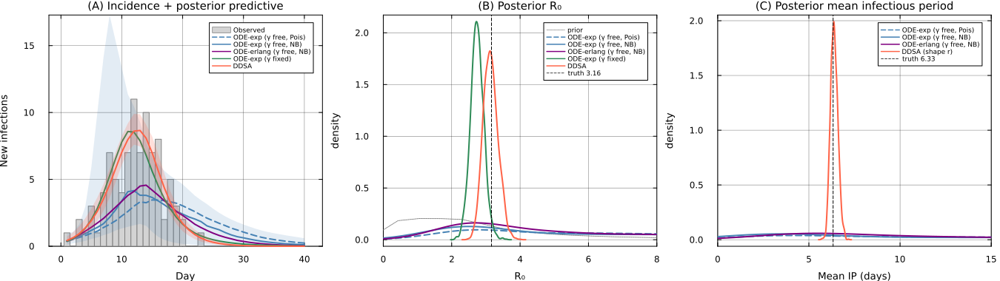

# DDSA vs deterministic-ODE fitting of aggregated incidence counts
DDSA paper

# Overview

This notebook contrasts discrete dynamic survival analysis (DDSA) with
fitting a deterministic compartmental ODE to aggregated daily counts
under a Poisson or Negative-Binomial observation model (see the
[epirecipes
notebook](https://github.com/epirecipes/sir-julia/blob/master/markdown/ode_turing/ode_turing.md)).

Epidemiological data can be presented as a line list of onset and
recovery events. A common path aggregates those events into a daily
incidence curve and fits a continuous-time ODE, evaluating the solution
at integer days. DDSA is built in discrete time and uses the line list
directly.

To compare the two approaches, we generate a synthetic outbreak with a
known non-exponential infectious period (Erlang-4; $k=4$) and fit five
models. The table below varies the forward model, how the
infectious-period (IP) shape is treated (*assumed* vs *inferred*),
whether the mean IP (removal rate $\gamma$) is inferred or fixed, and
the observation likelihood:

| Model | Forward model | IP shape | Mean IP / $\gamma$ | Inference likelihood |
|----|----|----|----|----|
| 1\. ODE + Poisson | Continuous SIR ODE | Exponential (single $I$), *assumed* | $\gamma$ *inferred* | Poisson on daily counts |
| 2\. ODE + NegBin | Continuous SIR ODE | Exponential (single $I$), *assumed* | $\gamma$ *inferred* | Negative-Binomial on daily counts |
| 3\. ODE (staged) + NegBin | Continuous SIR ODE, 4 $I$-stages | Erlang-4 (four staged $I$), *assumed* | $\gamma$ *inferred* | Negative-Binomial on daily counts |
| 4\. ODE, $\gamma$ fixed | Continuous SIR ODE | Exponential (single $I$), *assumed* | $\gamma$ *fixed* from literature ($\mu=4$ d) | Negative-Binomial on daily counts |
| 5\. DDSA | Discrete GLCT map | Discrete phase-type (NegBin), *inferred* (shape $r$) | mean IP *inferred* | Multinomial onsets, phase-type recovery intervals, Binomial final size |

The four ODE comparators represent realistic practitioner choices when
only an incidence curve is available. Models 1 and 2 are the default
workflow: fit a standard exponential SIR ODE to daily counts, with
Poisson or Negative-Binomial noise. Model 3 represents a practitioner
who suspects a non-exponential IP (for example, from qualitative
knowledge that the infectious period is less variable than the
exponential) and uses a staged ODE to reflect this, but still leaves
$\gamma$ free because no reliable external estimate exists. Model 4
represents one approach of anchoring the IP mean from prior literature —
fixing $\gamma$ at a published estimate — while retaining the default
exponential shape. DDSA (Model 5) represents the alternative when
individual-level records are available: the line list supplies recovery
intervals that make joint inference of IP shape and mean possible,
without external assumptions.

This comparison illustrates specific instances rather than suggesting a
best practice recipe. ODE models can use any integrator or count
observation model. DDSA is similarly modular, the recovery term can be
any discrete phase-type distribution (geometric, NegBin/DPH, boxcar)
with shape fixed or inferred, and onset or final-size terms can be
dropped when those records are unavailable.

# Setup

``` julia
using Turing, Distributions, Random, Statistics, LinearAlgebra, DataFrames
using OrdinaryDiffEq, Plots, StatsPlots
include("./PhaseTypeDistributions.jl")
Random.seed!(1234)
```

# DDSA model and helper functions

This section defines the DDSA components: helper functions, the discrete
Generalised Linear Chain Trick (GLCT) map, a synthetic line-list
generator, and the full DDSA model.

``` julia
"""Normalise a non-negative vector to sum to 1 (uniform fallback if all-zero)."""
function safe_normalise(f::AbstractVector{T}, n::Int) where T
    f_pos = ifelse.(isnan.(f) .| .!isfinite.(f), zero(T), max.(f, zero(T)))
    sF = sum(f_pos)
    (sF > T(1e-15) && isfinite(sF)) ? f_pos ./ sF : fill(one(T)/n, n)
end

"""Convert a rate to a per-interval proportion, `1 - exp(-r·t)`."""
@inline function rate_to_proportion(r, t=1.0)
    (r < 0 || isnan(r)) && return 0.0
    isinf(r) && return 1.0
    res = 1 - exp(-r * t)
    isnan(res) ? 0.0 : max(min(res, 1.0), 0.0)
end

"""Run the discrete GLCT forward map over `nsteps` steps from initial infected
fraction `ρ`, with phase-type generator `(Tm, α)`, transmission `β`, and step `Δt`.
Returns `(S, τ, f)`: the susceptible-fraction history, the attack fraction `τ`, and
the normalised infection-time PMF `f`."""
function simulate_discrete_glct(Tm, α, β, ρ, nsteps::Int, Δt)
    S = 1.0 - ρ; x = α .* ρ
    S_hist = Any[S]
    for _ in 1:nsteps
        new_inf = rate_to_proportion(β * sum(x), Δt) * S
        x = Tm' * x + α .* new_inf
        S -= new_inf
        push!(S_hist, S)
    end
    τ = S_hist[1] - S_hist[end]
    f = max.(-diff(S_hist), 0.0)
    sF = sum(f); f = sF > 0 ? f ./ sF : fill(one(eltype(f))/length(f), length(f))
    return (S=S_hist, τ=τ, f=f)
end

"""Simulate one synthetic line list from the discrete GLCT truth with transmission `β`,
phase-type IP generator `(Tm, α)`, initial infected fraction `ρ`, and population `N`,
over `n_events` steps of size `Δt`. Draws the final size `K ~ Binomial(N, τ)`, the onset
histogram `th ~ Multinomial(K, f)`, and `M + K` recovery intervals `delta`. Returns a
`Dict` with keys `:K, :th, :delta, :τ, :f`."""
function generate_discrete_glct_data(β, Tm, α, ρ, N, M, n_events, Δt)
    res = simulate_discrete_glct(Tm, α, β, ρ, n_events, Δt)
    K = rand(Binomial(N, res.τ))
    th = K > 0 ? rand(Multinomial(K, res.f ./ sum(res.f))) : zeros(Int, n_events)
    delta = Int[]
    dph = PhaseTypeDistributions.DPH(α, Tm)
    for _ in 1:(M + K)
        u = rand(); cum = 0.0; rt = 1
        while cum < u
            cum += PhaseTypeDistributions.pmf(dph, rt)
            cum >= u && break
            rt += 1
        end
        push!(delta, rt)
    end
    return Dict(:K => K, :th => th, :delta => delta, :τ => res.τ, :f => res.f)
end

β_prior_hi = 2.5    # shared β-prior upper bound for all 5 models

"""DDSA model: final size (Binomial), onset times (Multinomial), and recovery intervals (NegBin phase-type)."""
@model function dph_full(N::Int, M::Int, nsteps::Int, K::Int,
                         th::Vector{Int}, delta::Vector{Int}, nb_r_max::Int, Δt::Float64)
    β    ~ Uniform(1e-4, β_prior_hi)
    ρ    ~ Beta(1.0, N - 1)
    nb_p ~ Beta(1.0, 1.0)
    nb_r ~ DiscreteUniform(1, nb_r_max)
    dph     = PhaseTypeDistributions.dph_negative_binomial(nb_r, nb_p)
    result  = simulate_discrete_glct(dph.S, dph.α, β, ρ, nsteps, Δt)
    τ_valid = clamp(result.τ, 0.001, 0.999)
    f_safe  = safe_normalise(result.f, nsteps)
    K ~ Binomial(N, τ_valid)
    if K > 0
        if all(x -> isfinite(x) && !isnan(x), f_safe) && abs(sum(f_safe) - 1) < 0.01
            th ~ Multinomial(K, f_safe)
        else
            Turing.@addlogprob! -Inf
        end
    end
    for i in 1:(M + K)
        delta[i] ~ dph
    end
end
```

# Synthetic line-list data

We simulate an Erlang-4 outbreak with $\beta=0.5$/step, $N=99$,
$\rho=1/N$ (one index case), and a timeline length of $T=40$ d
(continuous Erlang mean $\mu=4$ d). At $\Delta t=1$ d the discrete
dwell-time mean is $E[W]\approx6.33$ d, giving discrete
$R_0=\beta E[W]\approx3.16$. The continuous calibration
$R_0=\beta\mu=2.0$ differs because $\Delta t=1$ inflates the effective
mean IP.

``` julia
N_pop   = 99
R0_cal, μ_ip, k, Δt = 2.0, 4.0, 4, 1.0
ρ_true  = 1.0 / N_pop
nsteps  = 40
β_true  = (R0_cal / μ_ip) * Δt
dph_nom = PhaseTypeDistributions.dph_erlang_from_mean(k, μ_ip, Δt)
EW      = PhaseTypeDistributions.mean(dph_nom)
R0_imp  = β_true * EW

data  = generate_discrete_glct_data(β_true, dph_nom.S, dph_nom.α, ρ_true, N_pop, 1, nsteps, Δt)
K, th, delta = data[:K], data[:th], data[:delta]
N = N_pop
incidence = th
```

    Truth: β=0.5, E[W]=6.33 d, R0_imp=3.16, R0_cont=2.0
    Obs:   K=91, attack=0.919, recovery mean=6.41 d, CV=0.246

# Count-based comparators (continuous ODE + Poisson/NegBin counts)

Models 1–4 follow the `ode_turing` recipe: solve a continuous-time SIR
ODE, read expected daily new infections from cumulative incidence, and
attach a Poisson or Negative-Binomial count likelihood. Each evaluation
solves the ODE inside the likelihood loop using an explicit RK
integrator (Tsit5) and rejects non-finite solutions.

``` julia
NegBin2(m, ϕ) = NegativeBinomial(ϕ, clamp(ϕ / (ϕ + m), 1e-6, 1.0 - 1e-6))

function sir_exp_ode!(du, u, p, t)        # exponential IP (single I) -- shape mis-specified
    (S, I, R, C) = u; (β, γ) = p; Npop = S + I + R
    inf = β * I / Npop * S
    du[1] = -inf; du[2] = inf - γ*I; du[3] = γ*I; du[4] = inf
end

function sir_erlang_ode!(du, u, p, t)     # Erlang-4 IP (4 staged I) -- correctly staged
    S = u[1]; I = @view u[2:5]; (β, γ) = p
    Npop = S + sum(I) + u[7]
    inf = β * sum(I) / Npop * S
    kγ = k * γ
    du[1] = -inf
    du[2] = inf      - kγ*I[1]
    du[3] = kγ*I[1]  - kγ*I[2]
    du[4] = kγ*I[2]  - kγ*I[3]
    du[5] = kγ*I[3]  - kγ*I[4]
    du[7] = kγ*I[4]                       # R
    du[6] = inf                            # cumulative incidence C
end

# (1) exponential IP, gamma free, Poisson counts -- "sample a Poisson" practice.
@model function count_exp_pois(y, N)
    l = length(y)
    i0  ~ Uniform(1e-4, 0.2); β ~ Uniform(1e-4, β_prior_hi); γ ~ Uniform(0.02, 1.0)
    I0 = i0 * N
    prob = ODEProblem(sir_exp_ode!, [N - I0, I0, 0.0, 0.0], (0.0, float(l)), [β, γ])
    sol  = solve(prob, Tsit5(), saveat = 1.0)
    C    = Array(sol)[4, :]; newI = clamp.(diff(C), 1e-6, 1e7)
    (length(newI) == l && all(isfinite, newI)) || (Turing.@addlogprob! -Inf; return)
    for i in 1:l; y[i] ~ Poisson(newI[i]); end
end

# (2) exponential IP, gamma free, NegBin counts -- same, with overdispersion.
@model function count_exp(y, N)
    l = length(y)
    i0  ~ Uniform(1e-4, 0.2); β ~ Uniform(1e-4, β_prior_hi)
    γ   ~ Uniform(0.02, 1.0); ϕ ~ Exponential(5.0)
    I0 = i0 * N
    prob = ODEProblem(sir_exp_ode!, [N - I0, I0, 0.0, 0.0], (0.0, float(l)), [β, γ])
    sol  = solve(prob, Tsit5(), saveat = 1.0)
    C    = Array(sol)[4, :]; newI = clamp.(diff(C), 1e-6, 1e7)
    (length(newI) == l && all(isfinite, newI)) || (Turing.@addlogprob! -Inf; return)
    for i in 1:l; y[i] ~ NegBin2(newI[i], ϕ); end
end

# (3) Erlang-4 IP, gamma free, NegBin -- correct shape, but assumed not learned.
@model function count_erlang(y, N)
    l = length(y)
    i0  ~ Uniform(1e-4, 0.2); β ~ Uniform(1e-4, β_prior_hi)
    γ   ~ Uniform(0.02, 1.0); ϕ ~ Exponential(5.0)
    I0 = i0 * N
    u0 = [N - I0, I0, 0.0, 0.0, 0.0, 0.0, 0.0]
    prob = ODEProblem(sir_erlang_ode!, u0, (0.0, float(l)), [β, γ])
    sol  = solve(prob, Tsit5(), saveat = 1.0)
    C    = Array(sol)[6, :]; newI = clamp.(diff(C), 1e-6, 1e7)
    (length(newI) == l && all(isfinite, newI)) || (Turing.@addlogprob! -Inf; return)
    for i in 1:l; y[i] ~ NegBin2(newI[i], ϕ); end
end

# (4) exponential IP, gamma fixed at the continuous-time mean IP from prior literature (μ_ip = 4 d).
# a practitioner reads "mean IP ≈ 4 days" in prior studies and sets γ accordingly.
γ_fix = 1.0 / μ_ip
@model function count_exp_fixed(y, N, γf)
    l = length(y)
    i0 ~ Uniform(1e-4, 0.2); β ~ Uniform(1e-4, β_prior_hi); ϕ ~ Exponential(5.0)
    I0 = i0 * N
    prob = ODEProblem(sir_exp_ode!, [N - I0, I0, 0.0, 0.0], (0.0, float(l)), [β, γf])
    sol  = solve(prob, Tsit5(), saveat = 1.0)
    C    = Array(sol)[4, :]; newI = clamp.(diff(C), 1e-6, 1e7)
    (length(newI) == l && all(isfinite, newI)) || (Turing.@addlogprob! -Inf; return)
    for i in 1:l; y[i] ~ NegBin2(newI[i], ϕ); end
end
```

# Infection Timing Equivalence

Independent Poisson daily counts, conditioned on their total $K$, follow
a $\mathrm{Multinomial}(K,f)$ distribution—identical to the
infection-time term in DDSA. The count–Poisson log-likelihood therefore
factorises as

$$\sum_t \log\mathrm{Pois}(y_t;\mu_t) \;=\; \underbrace{\log\mathrm{Multinomial}(y;K,f)}_{\text{DDSA infection-time term}} \;+\; \underbrace{\log\mathrm{Pois}\!\left(K;\textstyle\sum_t\mu_t\right)}_{\text{final-size term}}, \qquad f_t = \mu_t / \textstyle\sum_s\mu_s .$$

DDSA uses this multinomial timing term but replaces the Poisson
final-size factor with $\mathrm{Binomial}(N,\tau)$ to explicitly account
for a known at-risk population $N$. It also introduces a
recovery-interval term that aggregated counts cannot capture. Assuming
Poisson noise, a correctly specified infectious period, and large $N$,
both approaches yield consistent infection timing. They diverge only
when the line list provides higher-resolution data: individual recovery
durations (which identify the IP mean and shape) and tighter small-$N$
final-size constraints. For the ODE model, $\mu_t$ is sampled from a
continuous solution at integer days, so its timing PMF $f$ matches
DDSA’s only up to discretisation error. The following Julia
implementation demonstrates this factorisation on the exponential ODE’s
mean curve:

``` julia
prob0 = ODEProblem(sir_exp_ode!, [N - ρ_true*N, ρ_true*N, 0.0, 0.0],
                   (0.0, float(nsteps)), [β_true, γ_fix])
C0    = Array(solve(prob0, Tsit5(), saveat = 1.0))[4, :]
μ_ode = max.(diff(C0), 1e-9)                  # expected daily new infections
f_ode = μ_ode ./ sum(μ_ode)
ll_pois  = sum(logpdf.(Poisson.(μ_ode), incidence))   # count + Poisson, all days
ll_multi = logpdf(Multinomial(K, f_ode), incidence)   # = DDSA's infection-time term
ll_total = logpdf(Poisson(sum(μ_ode)), K)             # Poisson on the grand total
```

    count-Poisson   Σ logPois(yₜ;μₜ)   = -67.4417
    Multinomial(y;K,f) [timing term]   = -63.1071
    Poisson(K; total)  [final size]    = -4.3346
    timing + final size                = -67.4417
    identity holds: true

# Fitting all models

All five models are sampled with 2000 warm-up and 2000 posterior draws.
The three $\gamma$-free count models use NUTS with target acceptance
0.95 and `max_depth` 12. The $\gamma$-fixed model uses standard NUTS
(target acceptance 0.8). DDSA uses a Gibbs scheme: Metropolis–Hastings
for the discrete shape $r$ and NUTS on $(\beta, \rho, p)$.

``` julia
n_warm, n_post = 2000, 2000
nuts_count = NUTS(n_warm, 0.95; max_depth=12, Δ_max=1000.0)
ch_pois = sample(count_exp_pois(incidence, N),        nuts_count, n_post; progress=false)
ch_exp  = sample(count_exp(incidence, N),             nuts_count, n_post; progress=false)
ch_erl  = sample(count_erlang(incidence, N),          nuts_count, n_post; progress=false)
ch_fix  = sample(count_exp_fixed(incidence, N, γ_fix), NUTS(1000, 0.8), n_post; progress=false)

nb_r_max = min(10, minimum(delta))
gibbs = Gibbs(:nb_r => MH(), (:β, :ρ, :nb_p) => NUTS(n_warm, 0.8; max_depth=10, Δ_max=1000.0))
r_init = Int(clamp(minimum(delta), 1, nb_r_max))
p_init = clamp(r_init / max(mean(delta), r_init + 0.5), 0.05, 0.95)
τ_obs  = K / N
R0_h   = clamp(-log(1 - min(τ_obs, 0.999)) / max(τ_obs, 1e-6), 0.5, 5.0)
β_init = clamp(R0_h * p_init / r_init, 1e-4, β_prior_hi)
init   = (; β = β_init, ρ = 1.0/N, nb_p = p_init, nb_r = r_init)
ch_ddsa = sample(dph_full(N, 1, nsteps, K, th, delta, nb_r_max, Δt), gibbs, n_post;
                 initial_params = init, progress=false)
```

# Results

Convergence diagnostics ($\hat R$, ESS, divergences) and posterior
medians with 95% credible intervals for $\beta$, mean IP, and $R_0$ are
reported by model.

``` julia
q(v)  = "$(round(median(v),digits=3)) [$(round(quantile(v,0.025),digits=3)), $(round(quantile(v,0.975),digits=3))]"
qi(v) = "$(Int(round(median(v)))) [$(Int(round(quantile(v,0.025)))), $(Int(round(quantile(v,0.975))))]"
βp, γp = vec(ch_pois[:β]), vec(ch_pois[:γ]); R0p = βp ./ γp; ipp = 1.0 ./ γp
βe, γe = vec(ch_exp[:β]),  vec(ch_exp[:γ]);  R0e = βe ./ γe; ipe = 1.0 ./ γe
βr, γr = vec(ch_erl[:β]),  vec(ch_erl[:γ]);  R0r = βr ./ γr; ipr = 1.0 ./ γr
βf  = vec(ch_fix[:β]); R0f = βf ./ γ_fix
βd, pr, rr = vec(ch_ddsa[:β]), vec(ch_ddsa[:nb_p]), vec(ch_ddsa[:nb_r])
ipd = rr ./ pr; R0d = βd .* ipd

function conv(nm, ch)
    s = DataFrame(summarystats(ch)); pn = propertynames(s)
    rh = :rhat in pn ? filter(isfinite, collect(skipmissing(s.rhat))) : Float64[]
    ecraw = :ess_bulk in pn ? s.ess_bulk : (:ess in pn ? s.ess : Float64[])
    ec = filter(isfinite, collect(skipmissing(ecraw)))
    dv = try Int(sum(ch[:numerical_error])) catch; 0 end
    mr = isempty(rh) ? NaN : maximum(rh); me = isempty(ec) ? NaN : minimum(ec)
    ess_str = isnan(me) ? "NaN" : string(Int(round(me)))
    println("  $nm: max R̂=$(round(mr,digits=3)), min ESS=$ess_str, divergences=$dv")
end

let βpr = rand(Uniform(1e-4, β_prior_hi), 200_000), γpr = rand(Uniform(0.02, 1.0), 200_000)
    global R0_prior = βpr ./ γpr
    r0_ci = round.(quantile(R0_prior,[0.025,0.975]),digits=2)
    println("prior R0: $(round(median(R0_prior),digits=2)) [$(r0_ci[1]), $(r0_ci[2])]")
end
```

    prior R0: 2.45 [0.13, 29.63]


    Convergence
      ODE-exp Poisson (γ free): max R̂=1.0, min ESS=290, divergences=0
      ODE-exp NegBin  (γ free): max R̂=1.007, min ESS=463, divergences=0
      ODE-erlang NB   (γ free): max R̂=1.005, min ESS=454, divergences=0
      ODE-exp NB   (γ fixed): max R̂=1.0, min ESS=783, divergences=0
      DDSA                     : max R̂=1.001, min ESS=383, divergences=0

    Posterior median [95% CrI]
    truth:                    β=0.5,  E[W]=6.33 d,  R0=3.16
    ODE-exp Poisson (γ free): β=0.483 [0.376, 0.899]  meanIP=16.541 [2.239, 46.231]  R0=7.695 [1.956, 19.486]
    ODE-exp NegBin  (γ free): β=0.524 [0.378, 1.053]  meanIP=12.114 [1.688, 46.63]  R0=6.062 [1.742, 20.24]
    ODE-erlang NB   (γ free): β=0.436 [0.327, 0.654]  meanIP=11.123 [2.853, 45.751]  R0=4.732 [1.804, 17.894]
    ODE-exp NB   (γ fixed):   β=0.686 [0.592, 0.783]  meanIP=4.0 d (fixed)  R0=2.742 [2.369, 3.133]
    DDSA (line list):         β=0.49 [0.431, 0.559]  meanIP=6.379 [6.028, 6.799]  R0=3.127 [2.746, 3.573]  r=4 [4, 4]

# Figure

Panel (A) shows observed daily incidence with posterior-predictive
medians and 95% bands for the exponential-NegBin ODE and DDSA. All five
models fit the incidence curve similarly. Panels (B) and (C) show
posterior densities for $R_0$ and mean infectious period, with the prior
(dotted) and true values (dashed) indicated.

The count models with $\gamma$ free (blue, purple) return posteriors
covering nearly the full prior range. The width is similar whether or
not the infectious period is correctly staged, suggesting the incidence
curve provides limited joint information on $\beta$ and $\gamma$. Fixing
$\gamma$ (green) concentrates the $R_0$ posterior but shifts it below
the truth: the continuous-time rate $\gamma=1/4$ overestimates the
removal rate relative to the effective discrete infectious period of
6.33 d. DDSA (red), informed by the individual recovery intervals,
recovers both $R_0$ and the mean infectious period without fixing
either.

<div id="fig-ddsa-vs-ode">



Figure 1

</div>

# Discussion

Count likelihoods and DDSA share the same infection-timing information:
a Poisson count likelihood conditioned on its total is exactly DDSA’s
multinomial onset term. All five models fit the incidence curve
comparably, so the differences between them lie not in goodness of fit
but in what each recovers about the underlying epidemic parameters.

Count models with $\gamma$ free (Models 1–3) return posteriors covering
much of the prior for both $R_0$ and the mean IP; this holds whether or
not the infectious period is correctly staged. Fixing $\gamma$ from the
literature (Model 4) narrows the $R_0$ posterior but introduces a
downward bias: the continuous-time rate $\gamma=1/4$ overestimates
removal relative to the effective discrete IP of 6.33 d, so the inferred
$R_0 = \hat\beta/\gamma_{\mathrm{fix}}$ undershoots the truth even as
$\hat\beta$ adjusts upward to fit the incidence curve. This bias was not
apparent from incidence data in this example. DDSA (Model 5), using the
same incidence together with recovery intervals and final size, recovers
$R_0$, mean IP, and dwell-time shape without fixing any IP parameter
externally.

When only daily incidence is available, count models can be the natural
choice. When a line list is also available, the recovery intervals
provide information that aggregated counts cannot: they can help
identify both the mean IP and its shape, and may reveal biases
introduced by external IP assumptions that are difficult to detect from
incidence data alone.
