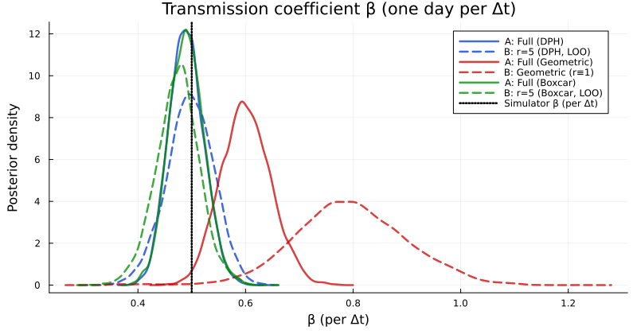
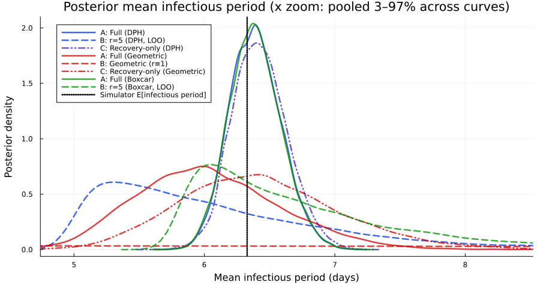
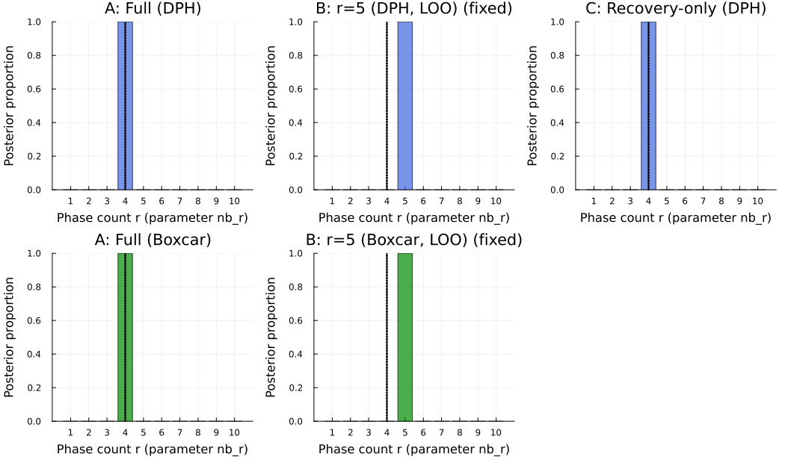
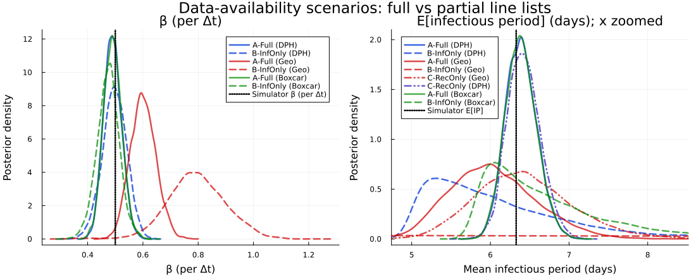
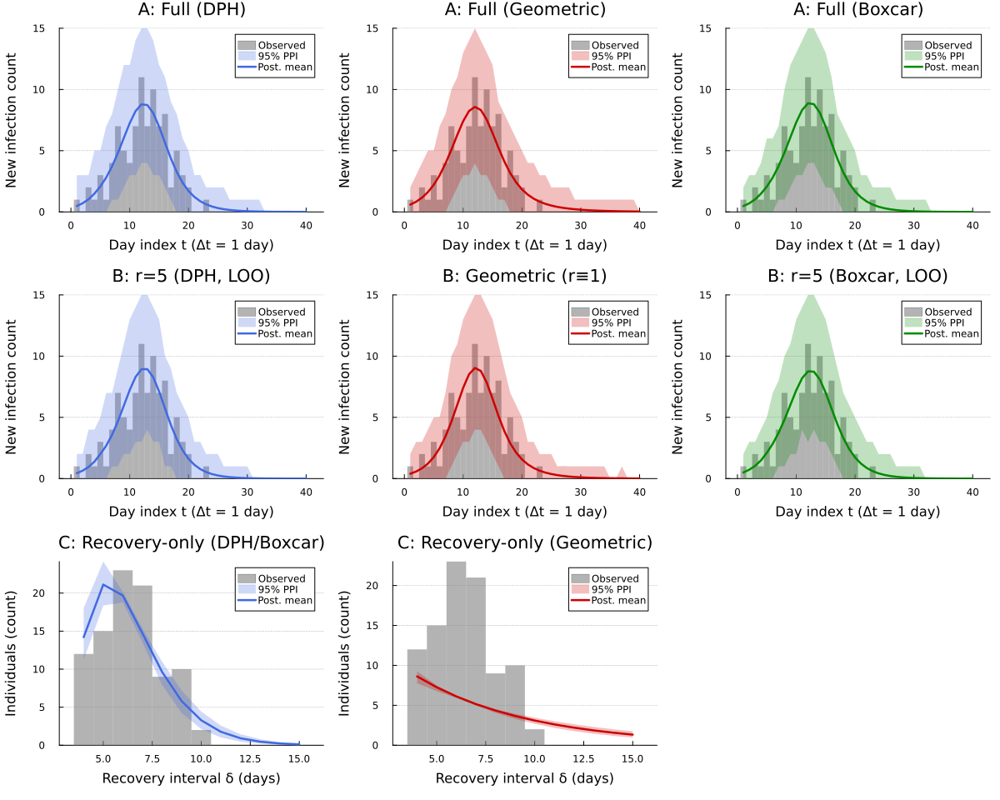

# DDSA data-availability scenarios
Sandra Montes (@slmontes)
2026-03-31

# Introduction

DDSA splits the log-likelihood into three parts: the infection-time
Multinomial term $\ell_I$, the recovery-interval phase-type term
$\ell_R$, and the Binomial final-size constraint $\ell_\text{constr}$.
Each piece contributes different information about transmission. In
practice, line lists are often incomplete: contact-tracing programmes
may capture infection onset times without follow-up on recovery, or
hospital records may provide recovery durations without precise
transmission dates. This notebook measures what each likelihood
component contributes by fitting DDSA under three data-availability
scenarios on one synthetic line list ($N=99$, $\rho=0.01$,
$\Delta t=1$,d, $T=40$,d). In every scenario, we compare three
infectious-period models: GLCT, Boxcar, and Geometric.

| Scenario | Observed data | Likelihood | Parameters identified |
|:---|:---|:---|:---|
| A — Full | Infection times, recovery intervals, final size | $\ell_I + \ell_R + \ell_\text{constr}$ | $\beta$, $\rho$, $r$, $p$; mean IP $= r/p$ |
| B — Infection only | Infection times and final size | $\ell_I + \ell_\text{constr}$ | $\beta$, $\rho$, $p$, $R_0$; $r$ fixed by model comparison |
| C — Recovery only | Recovery intervals | $\ell_R$ | $r$, $p$; $\beta$ and $\rho$ not identifiable |

The simulator uses a continuous Erlang infectious period with mean
$\mu=4$,d, then embeds it in discrete time at $\Delta t=1$,d using
per-step transition probabilities from constant hazards
(i.e. $p = 1-e^{-r\Delta t}$). This discretisation increases the mean
relative to the continuous target: in the discrete model, the expected
infectious duration is $E[W]\approx 6.33$,d (for $\mu=4$,d at
$\Delta t=1$,d). We therefore use $E[W]$, not $\mu$, as the reference
for posterior comparisons. We calibrate transmission as
$\beta_\text{rate}=R_0^\text{cal}/\mu=0.5$,d$^{-1}$ (with
$R_0^\text{cal}=2$), which implies a discrete-time reproduction number
$R_0^\text{imp}=\beta_\text{true}\times E[W]=3.164$. That value is the
target when comparing posterior $R_0=\beta\cdot r/p$. Inference uses a
flexible NegBin-DPH parameterisation $(r,p)$ with mean IP $=r/p$, and
does not force $r$ to match the simulator’s Erlang stage count $k=4$.

In Scenario B, the NegBin shape $r$ is not jointly identifiable with
$(\beta,\rho,p)$ from incidence alone: many $(r,p,R_0)$ combinations
generate almost the same epidemic trajectory, so the joint posterior
mixes poorly. To address this, we treat $r$ as a model index and choose
it with PSIS-LOO [(Vehtari, Gelman and Gabry,
2017)](https://link.springer.com/article/10.1007/S11222-016-9696-4). For
each candidate $r\in\{1,\ldots,10\}$, we fit a short NUTS chain under
the infection-only model and compute LOO over $K+1$ pointwise
log-likelihood terms: the final-size term $\log p(K\mid\theta)$ and the
$K$ individual infection-time terms $\log p(t_i\mid\theta)$. Together
these factorise $\log p(K,\mathbf{th}\mid\theta)$. We then fix $r$ at
the value that maximises $\mathrm{ELPD}_{\mathrm{LOO}}$ for Scenario B
inference. The Geometric sub-scenario ($r\equiv1$) does not need this
selection step.

## Libraries

The analysis uses Turing.jl for Bayesian inference, ParetoSmooth.jl for
PSIS-LOO model comparison, and a local `PhaseTypeDistributions.jl`
module for discrete phase-type distributions. We also apply a small
compatibility patch at load time so the Gibbs+MH step over the discrete
shape parameter $r$ works reliably with different Turing versions.

``` julia
using Random, LinearAlgebra, Statistics, Dates
using Turing
using StatsPlots
using Distributions
using StatsFuns: binomlogpdf
using ParetoSmooth
using Plots
using MCMCChains, DataFrames, Statistics
import Statistics: mean, var, std, median, quantile

if !isdefined(Main, :PhaseTypeDistributions)
    include("./PhaseTypeDistributions.jl")
end
using .PhaseTypeDistributions
```

### Turing/DynamicPPL compatibility patch

In Gibbs+MH runs, warmup and chain merging can call `Base.copy` on
internal inference-store objects. Some package versions do not define
these methods, which can trigger runtime errors. The guarded definitions
below are safe no-ops when the relevant types are absent (or already
fixed upstream).

``` julia
let Ti = Turing.Inference
    if isdefined(Ti, :StoreLinkedValues)
        Ty = getfield(Ti, :StoreLinkedValues)
        @eval Base.copy(::$Ty) = $Ty()
    end
    if isdefined(Ti, :StoreUnspecifiedPriors)
        Ty = getfield(Ti, :StoreUnspecifiedPriors)
        @eval Base.copy(x::$Ty) = $Ty(copy(x.vns_with_proposal))
    end
end
```

``` julia
Random.seed!(1234)
```

## Parameters

Here we define simulation settings and build the discrete DPH used to
generate the synthetic data (daily line list, $Δt=1$,d, horizon
$T=40$,d). The printed output reports the effective discrete mean
($E[W]$), the infectious-period coefficient of variation ($CV$), and the
implied reproduction number
($R_0^\text{imp}=\beta_\text{true}\times E[W]$), which is the reference
target used in the results.

``` julia
R0_cal = 2.0       # continuous calibration target; β_rate = R0_cal/μ_ip
ρ_true = 0.01
μ_ip   = 4.0       # continuous Erlang mean (not the discrete E[W])
k      = 4         # Erlang stages in simulator
Δt_nom = 1.0       # one MCMC/map step = one day; per-stage g = 1 - exp(-(k/μ_ip)*Δt_nom)
tspan  = (0.0, 40.0)
nsteps = Int(round(tspan[2] / Δt_nom))

β_rate = R0_cal / μ_ip             # day^-1; before dwell discretisation
β_true = β_rate * Δt_nom           # per-step coefficient in simulate_discrete_glct
β_prior_hi = 2.5                   # upper bound for β ~ Uniform(1e-4, β_prior_hi) 


dph_nom = PhaseTypeDistributions.dph_erlang_from_mean(k, μ_ip, Δt_nom)
nb_r    = k                        # shape of the continuous simulator Erlang k 
nb_mean = PhaseTypeDistributions.mean(dph_nom)   # discrete E[W]
nb_cv   = sqrt(PhaseTypeDistributions.var(dph_nom)) / nb_mean  # coefficient of variation
nb_p    = k / μ_ip                 # continuous Erlang rate (as reference)
R0_imp = β_true * nb_mean          # Implied R₀: R₀_imp = β × E[W] (discrete)

K_age   = findfirst(kk -> PhaseTypeDistributions.cdf(dph_nom, kk) >= 0.999, 1:500)
```

    Simulator: k=4 stages, μ_ip=4.0 d (continuous-time mean infectious period), Δt=1.0 d → discrete E[W] = 6.328 d, CV = 0.303, β_true = 0.5/step
      R₀_cal = 2.0 uses μ_ip only for β_rate = R₀_cal/μ_ip (does not equal β_true×E[W]).
      R₀_imp = β_true × E[W] = 3.164 — Reference to compare to posterior R₀.
    nsteps = 40

## Utility functions

In this we section define the helper functions used across all
scenarios: safe normalisation of incidence probability vectors,
conversion of rates to per-step proportions, discrete hazard computation
from phase-type and standard distributions, and expansion of an
incidence histogram into individual infection-time records for PSIS-LOO
scoring.

``` julia
"""Safely normalise a non-negative vector to sum to 1."""
function safe_normalise(f::AbstractVector{T}, n::Int) where T
    f_pos = ifelse.(isnan.(f) .| .!isfinite.(f), zero(T), max.(f, zero(T)))
    sF = sum(f_pos)
    (sF > T(1e-15) && isfinite(sF)) ? f_pos ./ sF : fill(one(T)/n, n)
end

"""Shared x-axis limits for mean infectious period (r/p) KDE plots: zoom to pooled quantiles."""
function mean_ip_density_xlims(vectors...; qlo=0.03, qhi=0.97, pad_frac=0.06)
    parts = [vec(v) for v in vectors if length(v) > 0]
    isempty(parts) && return (0.0, 15.0)
    v = reduce(vcat, parts)
    lo, hi = quantile(v, qlo), quantile(v, qhi)
    pad = max(pad_frac * (hi - lo), 0.5)
    return (max(0.0, lo - pad), hi + pad)
end

"""Convert a rate to a proportion over a unit time interval."""
@inline function rate_to_proportion(r, t=1.0)
    if r < 0 || isnan(r)
        return 0.0
    elseif isinf(r)
        return 1.0
    else
        result = 1 - exp(-r * t)
        return isnan(result) ? 0.0 : max(min(result, 1.0), 0.0)
    end
end

"""Discrete hazard h[k] = P(W=k)/P(W≥k) for NegBin(r,p) parameters; AD-compatible."""
function hazard_vector_negbin(nb_r::Integer, nb_p::T, K::Integer) where T <: Real
    pmf_vals = Vector{T}(undef, K)
    for k in 1:K
        if k < nb_r
            pmf_vals[k] = zero(T)
        else
            lp = PhaseTypeDistributions.negbin_total_logpdf(k, nb_r, nb_p)
            pmf_vals[k] = isfinite(lp) ? exp(lp) : zero(T)
        end
    end
    sf = reverse(cumsum(reverse(pmf_vals)))
    h  = Vector{T}(undef, K)
    for i in 1:K
        h[i] = (sf[i] > zero(T) && isfinite(sf[i])) ? pmf_vals[i] / sf[i] : T(0.01)
    end
    h[end] = one(T)
    return clamp.(h, zero(T), one(T))
end
```

# Boxcar SIR simulation

The Boxcar model represents the infectious period with explicit
infection-age cohorts: newly infected individuals enter the first age
class, then move through $r$ classes one step at a time, leaving each
class according to the NegBin hazard. Its incidence term,
$\beta(\sum I)S$, matches the GLCT forward map. So for a fixed
$(\beta,\rho)$ and dwell-time distribution, the two formulations induce
the same epidemic trajectory and should produce equivalent posteriors on
the same data.

``` julia
function sir_boxcar_map!(du, u, p, t)
    (β, h, K, Δt) = p
    Tel = eltype(u)
    S = u[1]
    ΣI = sum(u[2:K+1])
    R = u[K+2]
    # Probability-per-step infection update (hazard -> event probability).
    p_inf = rate_to_proportion(β * ΣI, Δt)
    new_inf = p_inf * S
    du[1] = S - new_inf
    du[K+2] = R
    @inbounds begin
        du[2] = new_inf
        for k in 2:K
            du[k+1] = zero(Tel)
        end
    end
    @inbounds for k in 1:K
        current_I = u[k+1]
        leave = current_I * h[k]
        stay = current_I - leave
        if k < K
            du[k+2] += stay
        end
        du[K+2] += leave
    end
    return nothing
end

function simulate_boxcar(β, h_rec, ρ, nsteps, K_age_classes, Δt)
    Tel = promote_type(typeof(β), eltype(h_rec), typeof(ρ))
    u0 = zeros(Tel, K_age_classes + 2)
    u0[1] = one(Tel) - ρ
    u0[2] = ρ
    u0[K_age_classes+2] = zero(Tel)
    sol = zeros(Tel, K_age_classes + 2, nsteps + 1)
    sol[:, 1] = u0
    p = (β, h_rec, K_age_classes, Δt)
    for t in 2:(nsteps+1)
        u_next = zeros(Tel, length(u0))
        sir_boxcar_map!(u_next, sol[:, t-1], p, t - 1)
        # NUTS + ForwardDiff can explore extreme parameters; keep S,I,R nonnegative and
        # S on [0,1] so τ = S(0)−S(T) stays finite (avoids NaN Dual in Binomial(N,τ)).
        u_next[1] = max(zero(Tel), min(one(Tel), u_next[1]))
        u_next[K_age_classes+2] = max(zero(Tel), u_next[K_age_classes+2])
        @inbounds for i in 2:(K_age_classes+1)
            u_next[i] = max(zero(Tel), u_next[i])
        end
        sol[:, t] = u_next
    end
    τ = u0[1] - sol[1, end]
    f = zeros(Tel, nsteps)
    for tt in 1:nsteps
        f[tt] = tt == 1 ? sol[1, 1] - sol[1, 2] : sol[1, tt] - sol[1, tt+1]
    end
    if sum(f) > 0
        f = f / sum(f)
    else
        f = fill(one(Tel)/nsteps, nsteps)
    end
    return sol, τ, f
end
```

# Discrete GLCT simulation

The GLCT forward map iterates the discrete SIR system using the
phase-type transition matrix for the infectious period. At each step,
new infections are distributed across infection stages according to the
initial probability vector $\alpha$, existing infections advance through
the sub-transition matrix $T$, and absorptions accumulate in the
recovered class. The incidence probability mass function is obtained
from the successive decrements in $S$.

``` julia
function simulate_discrete_glct(Tm::AbstractMatrix, α::AbstractVector, β::Real, ρ::Real, nsteps::Int, Δt::Real)
    k = length(α)
    @assert size(Tm, 1) == k == size(Tm, 2) "Tm must be k×k"
    S = 1.0 - ρ
    x = α .* ρ
    R = zero(ρ)
    S_hist = Any[S]
    I_hist = Any[sum(x)]
    R_hist = Any[R]
    times = collect(0.0:Δt:(nsteps*Δt))
    for _ in 1:nsteps
        I = sum(x)
        # Probability-per-step infection update (hazard -> event probability).
        p_inf = rate_to_proportion(β * I, Δt)
        new_inf = p_inf * S
        x = Tm' * x + α .* new_inf
        absorption_probs = ones(eltype(α), k) - Tm * ones(eltype(α), k)
        recov = dot(absorption_probs, x)
        S = S - new_inf
        R = R + recov
        push!(S_hist, S)
        push!(I_hist, sum(x))
        push!(R_hist, R)
    end
    τ = S_hist[1] - S_hist[end]
    dS = diff(S_hist)
    f = max.(-dS, 0.0)
    sF = sum(f)
    f = sF > 0 ? f ./ sF : fill(one(eltype(f))/length(f), length(f))
    return (times=times, S=S_hist, I=I_hist, R=R_hist, τ=τ, f=f)
end
```

# Synthetic line list

The synthetic dataset is generated in three steps: the deterministic
GLCT forward map produces the final attack rate $\tau$ and incidence PMF
$f$; the observed final size $K$ is then drawn from
$\text{Binomial}(N,\tau)$ and individual infection times from
$\text{Multinomial}(K,f)$; and each infectious period $\delta_i$ is
sampled from the Erlang-4 DPH by inverse CDF. All three scenarios
condition on the same single realisation of
$(K, \mathbf{th}, \boldsymbol{\delta})$.

``` julia
function generate_discrete_glct_data(β, Tm, α, ρ, N, M, n_events, Δt; rng::Union{Nothing,Random.AbstractRNG}=nothing)
    result = simulate_discrete_glct(Tm, α, β, ρ, n_events, Δt)
    τ = result.τ
    f = result.f
    K = isnothing(rng) ? rand(Binomial(N, τ)) : rand(rng, Binomial(N, τ))
    if K > 0 && length(f) > 0
        if length(f) != n_events
            f = f[1:n_events]
        end
        if sum(f) > 0
            f = f / sum(f)
        else
            f = fill(1.0/n_events, n_events)
        end
        th = isnothing(rng) ? rand(Multinomial(K, f)) : rand(rng, Multinomial(K, f))
    else
        th = zeros(Int, n_events)
    end
    delta = Int[]
    if M + K > 0
        dph = PhaseTypeDistributions.DPH(α, Tm)
        for _ in 1:(M + K)
            u = isnothing(rng) ? rand() : rand(rng)
            cum_prob = 0.0
            recovery_time = 1
            while cum_prob < u
                pmf_val = PhaseTypeDistributions.pmf(dph, recovery_time)
                cum_prob += pmf_val
                cum_prob >= u && break
                recovery_time += 1
            end
            push!(delta, recovery_time)
        end
    end
    return Dict(:K => K, :th => th, :delta => delta, :τ => τ, :f => f)
end
```

# Turing models

The following subsections define the Turing.jl probabilistic models for
each scenario and infectious-period representation. All models share the
same discrete epidemic forward map and differ only in which likelihood
components are active and which parameters are estimated.

## Scenario A — Full data ($\ell_I + \ell_R + \ell_\text{constr}$)

Scenario A uses the complete likelihood: the incidence histogram and
final size constrain the transmission parameters $(\beta, \rho)$, while
the individual recovery intervals identify the infectious period shape
$(r, p)$. With all three data streams present, the phase count $r$ is
sampled jointly with the continuous parameters via a Gibbs step.

``` julia
@model function dph_full(N::Int, M::Int, nsteps::Int, K::Int,
                          th::Vector{Int}, delta::Vector{Int},
                          nb_r_max::Int, Δt::Float64)
    # NegBin-DPH; Binomial/Multinomial for epidemic data; delta ~ DPH
    β    ~ Uniform(1e-4, β_prior_hi)
    ρ    ~ Beta(1.0, N - 1)
    nb_p ~ Beta(1.0, 1.0)
    nb_r ~ DiscreteUniform(1, nb_r_max)

    dph     = PhaseTypeDistributions.dph_negative_binomial(nb_r, nb_p)
    result  = simulate_discrete_glct(dph.S, dph.α, β, ρ, nsteps, Δt)
    τ_valid = clamp(result.τ, 0.001, 0.999)
    f_safe  = safe_normalise(result.f, nsteps)

    K ~ Binomial(N, τ_valid)
    if K > 0
        if all(x -> isfinite(x) && !isnan(x), f_safe) && abs(sum(f_safe) - 1) < 0.01
            th ~ Multinomial(K, f_safe)
        else
            Turing.@addlogprob! -Inf
        end
    end
    for i in 1:(M + K)
        delta[i] ~ dph
    end

    return (β=β, nb_r=nb_r, nb_p=nb_p, ρ=ρ, τ=τ_valid)
end
```

## Scenario B — Infection times with fixed phase count ($r$ from PSIS-LOO)

Scenario B uses only the infection-time likelihood
$\ell_I + \ell_\text{constr}$, with $r$ fixed to the PSIS-LOO-selected
value (see Introduction). The model is reparameterised in terms of $R_0$
and $p$, with $\beta = R_0\,p/r$ derived deterministically, so that the
sampler operates on the better-identified composite $(R_0, p, \rho)$
rather than on $(\beta, p, \rho)$ directly.

``` julia
@model function dph_infonly(N::Int, M::Int, nsteps::Int, K::Int,
                             th::Vector{Int}, Δt::Float64,
                             nb_r_max_prior::Int=10, nb_r_fixed::Int=0)
    # With r fixed: R₀ ~ Uniform, nb_p ~ Beta; β = R₀ * nb_p / r so R₀ = β * (r/nb_p).
    R₀      ~ Uniform(0.5, 5.0)
    ρ       ~ Beta(1.0, N - 1)
    nb_p    ~ Beta(1.0, 1.0)
    if nb_r_fixed > 0
        nb_r = nb_r_fixed
    else
        nb_r ~ DiscreteUniform(1, nb_r_max_prior)
    end
    β       = R₀ * nb_p / nb_r
    if !(0 < nb_p ≤ 1 && β > 0)
        Turing.@addlogprob! -Inf
        return nothing
    end

    dph     = PhaseTypeDistributions.dph_negative_binomial(nb_r, nb_p)
    result  = simulate_discrete_glct(dph.S, dph.α, β, ρ, nsteps, Δt)
    # Reject non-finite τ before clamp to avoid NaN poisoning AD gradients.
    if !isfinite(result.τ) || any(x -> !isfinite(x), result.f)
        Turing.@addlogprob! -Inf
        return nothing
    end
    τ_valid = clamp(result.τ, 0.001, 0.999)
    if !isfinite(τ_valid)
        Turing.@addlogprob! -Inf
        return nothing
    end
    f_safe  = safe_normalise(result.f, nsteps)

    lb = binomlogpdf(N, τ_valid, K)  # AD-safe; avoids Binomial(N,p) constructor on Dual types
    Turing.@addlogprob! isfinite(lb) ? lb : -Inf
    if K > 0
        if all(x -> isfinite(x) && !isnan(x), f_safe) && abs(sum(f_safe) - 1) < 0.01
            th ~ Multinomial(K, f_safe)
        else
            Turing.@addlogprob! -Inf
        end
    end

    return (β=β, R₀=R₀, nb_r=nb_r, nb_p=nb_p, ρ=ρ, τ=τ_valid)
end
```

## Scenario C — Recovery times only ($\ell_R$)

Without infection time data, the transmission rate $\beta$ and initial
fraction $\rho$ are not identified. We estimate only the infectious
period distribution parameters $(r, p)$ directly from recovery
intervals.

``` julia
@model function dph_reconly(delta::Vector{Int}, nb_r_max::Int)
    nb_r    ~ DiscreteUniform(1, nb_r_max)
    nb_p    ~ Beta(1.0, 1.0)
    dph     = PhaseTypeDistributions.dph_negative_binomial(nb_r, nb_p)
    for i in 1:length(delta)
        delta[i] ~ dph
    end
    return (nb_r=nb_r, nb_p=nb_p)
end
```

## Scenario C — Recovery times only (Geometric baseline)

The Geometric model for recovery-only inference estimates $p$ from
$\delta_i$ directly. Since Geometric $\equiv$ NegBin$(r=1)$ has a single
parameter, this is a NUTS-only run with no Metropolis-Hastings step
required.

``` julia
@model function geo_reconly(delta::Vector{Int})
    nb_p ~ Beta(1.0, 1.0)
    dph_geo = PhaseTypeDistributions.dph_geometric(nb_p)
    for i in 1:length(delta)
        delta[i] ~ dph_geo
    end
    return (nb_p=nb_p,)
end
```

## Geometric baseline — Scenario A ($\ell_I + \ell_R + \ell_\text{constr}$)

The geometric model is the memoryless special case of the NegBin DPH,
equivalent to a single exponential infectious stage ($r=1$). Fitting it
alongside the DPH model under the full likelihood quantifies the cost of
assuming exponential dwell times when the true infectious period has
lower coefficient of variation.

``` julia
@model function geo_full(N::Int, M::Int, nsteps::Int, K::Int,
                          th::Vector{Int}, delta::Vector{Int},
                          Δt::Float64)
    β    ~ Uniform(1e-4, β_prior_hi)
    ρ    ~ Beta(1.0, N - 1)
    nb_p ~ Beta(1.0, 1.0)

    dph_geo = PhaseTypeDistributions.dph_geometric(nb_p)
    result  = simulate_discrete_glct(dph_geo.S, dph_geo.α, β, ρ, nsteps, Δt)
    τ_valid = clamp(result.τ, 0.001, 0.999)
    f_safe  = safe_normalise(result.f, nsteps)

    K ~ Binomial(N, τ_valid)
    if K > 0
        if all(x -> isfinite(x) && !isnan(x), f_safe) && abs(sum(f_safe) - 1) < 0.01
            th ~ Multinomial(K, f_safe)
        else
            Turing.@addlogprob! -Inf
        end
    end
    for i in 1:(M + K)
        delta[i] ~ dph_geo
    end

    return (β=β, nb_p=nb_p, ρ=ρ, τ=τ_valid)
end
```

## Geometric baseline — Scenario B ($\ell_I + \ell_\text{constr}$)

Under Scenario B, the geometric model requires no shape selection step
since $r \equiv 1$ is fixed by definition. This provides a clean
infection-only baseline against which the GLCT and Boxcar results can be
compared.

``` julia
@model function geo_infonly(N::Int, M::Int, nsteps::Int, K::Int,
                             th::Vector{Int}, Δt::Float64)
    β    ~ Uniform(1e-4, β_prior_hi)
    ρ    ~ Beta(1.0, N - 1)
    nb_p ~ Beta(1.0, 1.0)

    dph_geo = PhaseTypeDistributions.dph_geometric(nb_p)
    result  = simulate_discrete_glct(dph_geo.S, dph_geo.α, β, ρ, nsteps, Δt)
    τ_valid = clamp(result.τ, 0.001, 0.999)
    f_safe  = safe_normalise(result.f, nsteps)

    K ~ Binomial(N, τ_valid)
    if K > 0
        if all(x -> isfinite(x) && !isnan(x), f_safe) && abs(sum(f_safe) - 1) < 0.01
            th ~ Multinomial(K, f_safe)
        else
            Turing.@addlogprob! -Inf
        end
    end
    # NO recovery likelihood

    return (β=β, nb_p=nb_p, ρ=ρ, τ=τ_valid)
end
```

## Boxcar — Scenario A ($\ell_I + \ell_R + \ell_\text{constr}$)

The Boxcar model is the infection-age representation of the same NegBin
DPH likelihood. Its state space has dimension $K_\text{age}+2$ (vs $r+2$
for DPH), but it is mathematically equivalent. Both correctly-specified
models should produce identical posteriors on the same data.

``` julia
@model function boxcar_full(N::Int, M::Int, nsteps::Int, K::Int,
                             th::Vector{Int}, delta::Vector{Int},
                             K_age_classes::Int, nb_r_max::Int, Δt::Float64)
    β    ~ Uniform(1e-4, β_prior_hi)
    ρ    ~ Beta(1.0, N - 1)
    nb_p ~ Beta(1.0, 1.0)
    nb_r ~ DiscreteUniform(1, nb_r_max)

    dph_bc  = PhaseTypeDistributions.dph_negative_binomial(nb_r, nb_p)
    h_rec   = hazard_vector_negbin(nb_r, nb_p, K_age_classes)
    _, τ, f = simulate_boxcar(β, h_rec, ρ, nsteps, K_age_classes, Δt)
    if !isfinite(τ) || any(x -> !isfinite(x), f)
        Turing.@addlogprob! -Inf
        return nothing
    end
    τ_valid = clamp(τ, 0.001, 0.999)
    if !isfinite(τ_valid)
        Turing.@addlogprob! -Inf
        return nothing
    end
    f_safe  = safe_normalise(f, nsteps)

    Turing.@addlogprob! binomlogpdf(N, τ_valid, K)  # AD-safe Binomial
    if K > 0
        if all(x -> isfinite(x) && !isnan(x), f_safe) && abs(sum(f_safe) - 1) < 0.01
            th ~ Multinomial(K, f_safe)
        else
            Turing.@addlogprob! -Inf
        end
    end
    for i in 1:(M + K)
        delta[i] ~ dph_bc
    end

    return (β=β, nb_r=nb_r, nb_p=nb_p, ρ=ρ, τ=τ_valid)
end
```

## Boxcar model for Scenario B (fixed $r$, $\ell_I + \ell_\text{constr}$)

The infection-only Boxcar model mirrors the DPH Scenario B
specification: $r$ is fixed to the PSIS-LOO-selected value and the GLCT
transition matrix is replaced by infection-age cohort dynamics. This
cross-checks that the two representations remain consistent when
recovery data are absent.

``` julia
@model function boxcar_infonly(N::Int, M::Int, nsteps::Int, K::Int,
                                th::Vector{Int},
                                K_age_classes::Int, nb_r_max_prior::Int, Δt::Float64,
                                nb_r_fixed::Int=0)
    R₀      ~ Uniform(0.5, 5.0)
    ρ       ~ Beta(1.0, N - 1)
    nb_p    ~ Beta(1.0, 1.0)
    if nb_r_fixed > 0
        nb_r = nb_r_fixed
    else
        nb_r ~ DiscreteUniform(1, nb_r_max_prior)
    end
    β       = R₀ * nb_p / nb_r

    if !(0 < nb_p ≤ 1 && β > 0)
        Turing.@addlogprob! -Inf
        return nothing
    end

    h_rec = hazard_vector_negbin(nb_r, nb_p, K_age_classes)
    _, τ, f = simulate_boxcar(β, h_rec, ρ, nsteps, K_age_classes, Δt)
    if !isfinite(τ) || any(x -> !isfinite(x), f)
        Turing.@addlogprob! -Inf
        return nothing
    end
    τ_valid = clamp(τ, 0.001, 0.999)
    if !isfinite(τ_valid)
        Turing.@addlogprob! -Inf
        return nothing
    end
    f_safe  = safe_normalise(f, nsteps)

    Turing.@addlogprob! binomlogpdf(N, τ_valid, K)
    if K > 0
        if all(x -> isfinite(x) && !isnan(x), f_safe) && abs(sum(f_safe) - 1) < 0.01
            th ~ Multinomial(K, f_safe)
        else
            Turing.@addlogprob! -Inf
        end
    end

    return (β=β, R₀=R₀, nb_r=nb_r, nb_p=nb_p, ρ=ρ, τ=τ_valid)
end
```

``` julia
"""Infection-only log-likelihood: returns (lb, lm) = (Binomial final-size, Multinomial incidence); lm=0 when K==0."""
function infonly_binom_multinom_loglik_dph_ref(
        N::Int, nsteps::Int, K_obs::Int, th::Vector{Int},
        R₀::Float64, nb_p::Float64, ρ::Float64, nb_r::Int, Δt::Float64)
    β = R₀ * nb_p / nb_r
    (0 < nb_p ≤ 1 && β > 0) || return (-Inf, -Inf)
    dph = PhaseTypeDistributions.dph_negative_binomial(nb_r, nb_p)
    result = simulate_discrete_glct(dph.S, dph.α, β, ρ, nsteps, Δt)
    if !isfinite(result.τ) || any(!isfinite, result.f)
        return (-Inf, -Inf)
    end
    τ_valid = clamp(result.τ, 0.001, 0.999)
    isfinite(τ_valid) || return (-Inf, -Inf)
    f_safe = safe_normalise(result.f, nsteps)
    all(x -> isfinite(x) && !isnan(x), f_safe) || return (-Inf, -Inf)
    abs(sum(f_safe) - 1) < 0.01 || return (-Inf, -Inf)
    lb = binomlogpdf(N, τ_valid, K_obs)
    isfinite(lb) || return (-Inf, -Inf)
    K_obs == 0 && return (lb, 0.0)
    lm = logpdf(Multinomial(K_obs, f_safe), th)
    isfinite(lm) || return (-Inf, -Inf)
    return (lb, lm)
end

"""Expand incidence histogram into individual infection times (1-based day indices)."""
function expand_hist_to_times(th::AbstractVector{<:Integer})
    K = sum(th)
    ti = Vector{Int}(undef, K)
    k = 0
    for t in eachindex(th)
        c = Int(th[t])
        for _ in 1:c
            k += 1
            ti[k] = Int(t)
        end
    end
    return ti
end

"""Summarise Pareto-k diagnostics from a `psis_loo` result."""
function pareto_k_summary(loo_res)
    ks = loo_res.pointwise(:pareto_k)
    ks = collect(ks)
    ks_f = filter(isfinite, ks)
    isempty(ks_f) && return (k_max=NaN, k_mean=NaN, n=0, n_gt_0_5=0, n_gt_0_7=0, n_gt_1_0=0)
    return (
        k_max    = maximum(ks_f),
        k_mean   = mean(ks_f),
        n        = length(ks_f),
        n_gt_0_5 = count(>(0.5), ks_f),
        n_gt_0_7 = count(>(0.7), ks_f),
        n_gt_1_0 = count(>(1.0), ks_f),
    )
end

"""PSIS-LOO for infection-only data: K+1 pointwise terms (Binomial final-size + K Categorical infection times)."""
function psis_loo_dph_infonly_fixedr_ref(chain, N::Int, nsteps::Int, K_obs::Int, th_obs::Vector{Int},
                                         nb_r::Int, Δt::Float64)
    R₀s = vec(chain[:R₀])
    ps = vec(chain[:nb_p])
    ρs = vec(chain[:ρ])
    S = length(R₀s)
    ti_obs = expand_hist_to_times(th_obs)
    @assert length(ti_obs) == K_obs
    ll = Array{Float64}(undef, K_obs + 1, S, 1)
    for i in 1:S
        R₀i = Float64(R₀s[i])
        pi  = Float64(ps[i])
        ρi  = Float64(ρs[i])

        β = R₀i * pi / nb_r
        (0 < pi ≤ 1 && β > 0) || begin
            ll[:, i, 1] .= -Inf
            continue
        end
        dph = PhaseTypeDistributions.dph_negative_binomial(nb_r, pi)
        result = simulate_discrete_glct(dph.S, dph.α, β, ρi, nsteps, Δt)
        if !isfinite(result.τ) || any(!isfinite, result.f)
            ll[:, i, 1] .= -Inf
            continue
        end
        τ_valid = clamp(result.τ, 0.001, 0.999)
        isfinite(τ_valid) || begin
            ll[:, i, 1] .= -Inf
            continue
        end
        f_safe = safe_normalise(result.f, nsteps)
        (all(x -> isfinite(x) && !isnan(x), f_safe) && abs(sum(f_safe) - 1) < 0.01) || begin
            ll[:, i, 1] .= -Inf
            continue
        end

        lb = binomlogpdf(N, τ_valid, K_obs)
        isfinite(lb) || begin
            ll[:, i, 1] .= -Inf
            continue
        end
        ll[1, i, 1] = lb

        if K_obs == 0
            # No infection-time terms when K=0.
        else
            for (j, t) in enumerate(ti_obs)
                ft = f_safe[t]
                ll[j + 1, i, 1] = (ft > 0 && isfinite(ft)) ? log(ft) : -Inf
            end
        end
    end
    if !any(isfinite, @view ll[:, :, 1])
        return (elpd_loo=-Inf, se_total=Inf, p_eff_loo=NaN, loo_result=nothing)
    end
    loo_res = psis_loo(ll)
    ksum = pareto_k_summary(loo_res)
    return (
        elpd_loo = loo_res.estimates(:cv_elpd, :total),
        se_total = loo_res.estimates(:cv_elpd, :se_total),
        p_eff_loo = loo_res.estimates(:p_eff, :total),
        pareto_k = ksum,
        loo_result = loo_res,
    )
end
```

# Data generation

The synthetic dataset is generated from the nominal parameters defined
above. The printed output reports the observed final size $K$, the
empirical mean and coefficient of variation of the recovery intervals,
and the Boxcar truncation length required to cover the worst-case prior
tail under Scenario B.

``` julia
# N = susceptibles followed, M = pre-study infected
N_sim  = 99
M_sim  = 1
ρ_sim  = ρ_true

data_fwd = generate_discrete_glct_data(β_true, dph_nom.S, dph_nom.α, ρ_sim,
                                        N_sim, M_sim, nsteps, Δt_nom)
K_obs      = data_fwd[:K]
th_obs     = data_fwd[:th]
delta_obs  = data_fwd[:delta]
τ_true_det = data_fwd[:τ]
f_true_det = data_fwd[:f]

nb_r_max_data = minimum(delta_obs)

# K_age_B: Boxcar state-space length for Scenario B; worst-case prior is Geometric(1/30)
# (r=1, mean=30 d), whose 99.9th percentile sets the required truncation.
dph_worst_B = PhaseTypeDistributions.dph_negative_binomial(1, 1.0/30.0)
K_age_B     = findfirst(k -> PhaseTypeDistributions.cdf(dph_worst_B, k) >= 0.999, 1:500)

println("Simulator: β_true=$β_true per Δt, k=$nb_r, μ_ip=$μ_ip d (CT mean input), E[W]=$(round(nb_mean,digits=3)) d, R₀_imp=$(round(R0_imp, digits=3)), τ_det=$(round(τ_true_det, digits=3))")
println("Observed: K=$K_obs / N=$N_sim  (attack rate $(round(K_obs/N_sim, digits=3)))")
println("Recovery: mean=$(round(mean(delta_obs), digits=2)) d, " *
        "min=$(minimum(delta_obs)), max=$(maximum(delta_obs)), " *
        "CV=$(round(std(delta_obs)/mean(delta_obs), digits=3))")
println("nb_r_max_data = $nb_r_max_data,  K_age = $K_age  (Scenario A),  K_age_B = $K_age_B  (Scenario B Boxcar)")
```

    Simulator: β_true=0.5 per Δt, k=4, μ_ip=4.0 d (CT mean input), E[W]=6.328 d, R₀_imp=3.164, τ_det=0.941
    Observed: K=91 / N=99  (attack rate 0.919)
    Recovery: mean=6.41 d, min=4, max=10, CV=0.246
    nb_r_max_data = 4,  K_age = 15  (Scenario A),  K_age_B = 204  (Scenario B Boxcar)

# MCMC inference

All chains are initialised from data-informed starting points. With a
stiff epidemic forward map and diffuse priors on $(\beta, \rho)$, random
draws from the prior almost never produce dynamics consistent with the
observed data, so leaving the sampler to find its own starting values
leads to slow or failed warmup. For Scenarios A, C, and Boxcar A,
initial values are derived from the observed line list: $r$ is set to
the minimum observed recovery interval, $p$ is matched to the empirical
mean infectious period, and $R_0$ is estimated from the observed attack
rate via the final-size relation. Scenario B is the hardest case:
without recovery intervals, the initial $p$ is set from a default
mean-infectious-period scale, and $R_0$ is estimated from the observed
final size alone. These starting values are a numerical feasibility aid;
the posterior is defined entirely by the likelihood and priors, and
convergence diagnostics at the end of this notebook confirm that all
chains reach their target distributions.

``` julia
# 10_000 draws gives better convergence than 5_000 (especially Scenario B and Boxcar).
n_samples  = 10_000
nuts_adapt = 2_000
nb_r_max   = 10        # upper bound for DiscreteUniform prior on nb_r (Scenarios A, Boxcar A)
Δt_val     = Δt_nom  # must match simulator time step (here: 1 day per step)

gibbs_A    = Gibbs(:nb_r => MH(),
                   (:β, :ρ, :nb_p) => NUTS(nuts_adapt, 0.8; max_depth=10, Δ_max=1000.0))
gibbs_C    = Gibbs(:nb_r => MH(),
                   :nb_p => NUTS(nuts_adapt, 0.8; max_depth=10, Δ_max=1000.0))
# Boxcar A: mirror gibbs_A — MH(nb_r) + one joint NUTS on (β, ρ, nb_p) for mixing comparable to DPH A
gibbs_Abc  = Gibbs(:nb_r => MH(),
                   (:β, :ρ, :nb_p) => NUTS(nuts_adapt, 0.8; max_depth=10, Δ_max=1000.0))
nuts_B_fixed   = NUTS(nuts_adapt, 0.8; max_depth=10, Δ_max=1000.0)
nuts_Bbc_fixed = NUTS(nuts_adapt, 0.8; max_depth=10, Δ_max=1000.0)
nuts_sampl     = NUTS(nuts_adapt, 0.8; max_depth=10, Δ_max=1000.0)  # Geo models
# Shorter NUTS runs per r for PSIS-LOO; full `n_samples` only for LOO-selected r
loo_grid_nuts_adapt = 500
n_loo_per_r         = 2000
nuts_B_loo          = NUTS(loo_grid_nuts_adapt, 0.8; max_depth=10, Δ_max=1000.0)
# Infection-only init: default mean-IP scale for p ≈ r / m_guess (no δ̄ from recovery)
m_ip_init_guess = 15.0

τ_obs   = K_obs / N_sim
R0_init = -log(1 - min(τ_obs, 0.999)) / max(τ_obs, 1e-6)
println("Final-size heuristic (diagnostic only): τ_obs=$(round(τ_obs,digits=3)), R₀_init=$(round(R0_init,digits=2))")

# Pass data-feasible starting point; prior draws almost never land in the typical set.
r_init_gibbs = Int(clamp(minimum(delta_obs), 1, nb_r_max))
delta_bar_g  = mean(delta_obs)
R0_h_g       = clamp(-log(1 - min(τ_obs, 0.999)) / max(τ_obs, 1e-6), 0.5, 5.0)
p_init_g     = clamp(r_init_gibbs / max(delta_bar_g, r_init_gibbs + 0.5), 0.05, 0.95)
β_init_g     = clamp(R0_h_g * p_init_g / r_init_gibbs, 1e-4, β_prior_hi)
ρ_init_g     = clamp(1.0 / N_sim, 1e-6, 1.0 - 1e-6)
init_A_gibbs = (; β = β_init_g, ρ = ρ_init_g, nb_p = p_init_g, nb_r = r_init_gibbs)

r_init_C = Int(clamp(minimum(delta_obs), 1, nb_r_max_data))
p_init_C = clamp(r_init_C / max(mean(delta_obs), r_init_C + 0.5), 0.05, 0.95)
init_C_gibbs = (; nb_r = r_init_C, nb_p = p_init_C)

println("Sampling: Gibbs (A, C, Boxcar A) use line-list heuristics incl. recovery stats; " *
        "Scenario B / PSIS-LOO use (K,N)-only R₀ init and p ≈ r / m_ip_init_guess.")
```

## Scenario A — Full DDSA (DPH)

Scenario A uses all three data streams:
$\ell_I + \ell_R + \ell_\text{constr}$. With full data, the phase count
$r$ is identifiable from recovery intervals: the Gibbs/MH step for the
discrete $r$ mixes well because the NegBin recovery likelihood
discriminates sharply between different $r$ values.

``` julia
model_A = dph_full(N_sim, M_sim, nsteps, K_obs, th_obs, delta_obs, nb_r_max, Δt_val)
_ = sample(model_A, gibbs_A, 1; progress=false, initial_params=init_A_gibbs)
t_A = @elapsed chain_A = sample(model_A, gibbs_A, n_samples;
                                progress=false, initial_params=init_A_gibbs)
```

    Scenario A (Full DPH): 7.9 s

## PSIS-LOO selection of $r$ for Scenario B (infection-only DPH)

For each candidate $r \in \{1, \ldots, 10\}$, a short NUTS chain (2000
draws, 500 warmup steps) is run under the infection-only model and the
PSIS-LOO score is evaluated on the $K+1$ individual observations
described in the Introduction. The output reports, for each $r$: the
total $\text{elpd}_\text{LOO}$ and its Monte Carlo standard error, the
effective number of parameters $p_\text{LOO}$, and Pareto-$\hat{k}$
diagnostics that assess importance-sampling reliability. The value of
$r$ with the highest $\text{elpd}_\text{LOO}$ is carried forward to the
full Scenario B chain. Because the incidence curve alone discriminates
weakly between adjacent NegBin shapes, the selected $r$ need not equal
the simulator’s Erlang stage count $k=4$; Scenario C provides the
appropriate benchmark for shape recovery when recovery data are present.

``` julia
τ_B  = K_obs / N_sim
R0_h = clamp(-log(1 - min(τ_B, 0.999)) / max(τ_B, 1e-6), 0.5, 5.0)
ρ_B0 = 1.0 / N_sim

elpd_loo_vals = fill(-Inf, nb_r_max)
for r_try in 1:nb_r_max
    p_try = clamp(r_try / max(m_ip_init_guess, r_try + 0.5), 0.05, 0.95)
    init_try = (; R₀ = R0_h, nb_p = p_try, ρ = ρ_B0)
    model_try = dph_infonly(N_sim, M_sim, nsteps, K_obs, th_obs, Δt_val, nb_r_max, r_try)
    _ = sample(model_try, nuts_B_loo, 1; progress=false, initial_params=init_try)
    ch_try = sample(model_try, nuts_B_loo, n_loo_per_r;
                    progress=false, initial_params=init_try, source=false)
    res = psis_loo_dph_infonly_fixedr_ref(ch_try, N_sim, nsteps, K_obs, th_obs, r_try, Δt_val)
    elpd_loo_vals[r_try] = res.elpd_loo
    k = res.pareto_k  
end
good = findall(isfinite, elpd_loo_vals)
if isempty(good)
    @warn "PSIS-LOO non-finite for all r; falling back to r_selected_B = 1."
    r_selected_B = 1
else
    r_selected_B = good[argmax(elpd_loo_vals[good])]
end
```

    Selected r = 5  (Erlang k = 4)  elpd_LOO = -266.07

## Scenario B — Infection-only DDSA (DPH, $r$ fixed to PSIS-LOO choice)

With $r$ fixed to the LOO-selected value, NUTS targets the
three-dimensional posterior $(R_0, p, \rho)$ and mixes efficiently
without the shape-identifiability problem that arises when $r$ is free.

``` julia
model_B = dph_infonly(N_sim, M_sim, nsteps, K_obs, th_obs, Δt_val, nb_r_max, r_selected_B)
# Feasible start: final-size R₀ from (K,N) only; p ≈ r / m_guess 
p_h = clamp(r_selected_B / max(m_ip_init_guess, r_selected_B + 0.5), 0.05, 0.95)
init_B = (; R₀ = R0_h, nb_p = p_h, ρ = ρ_B0)
_ = sample(model_B, nuts_B_fixed, 1; progress=false, initial_params=init_B)
t_B = @elapsed chain_B = sample(model_B, nuts_B_fixed, n_samples;
                                 progress=false, initial_params=init_B)
```

    Scenario B (DPH, r=5 from PSIS-LOO): 8.3 s

## Scenario C — Recovery-only DDSA (DPH)

Scenario C uses only the recovery likelihood $\ell_R$. With recovery
data alone, $r$ is identifiable: the Gibbs/MH step explores
$r \in \{1, \ldots, r_\text{max\_data}\}$ where
$r_\text{max\_data} = \min(\delta_i)$ (the data-derived upper bound;
NegBin total-trials support is $\{r, r+1, \ldots\}$).

``` julia
model_C = dph_reconly(delta_obs, nb_r_max_data)
_ = sample(model_C, gibbs_C, 1; progress=false, initial_params=init_C_gibbs)
t_C = @elapsed chain_C = sample(model_C, gibbs_C, n_samples;
                                progress=false, initial_params=init_C_gibbs)
```

    Scenario C (Recovery-only DPH): 2.6 s
    Scenario C: inferred nb_r = 4  (Erlang k = 4)

## Scenario C — Recovery times only (Geometric)

The geometric recovery-only model provides a single-parameter baseline
for comparison with the DPH result under Scenario C.

``` julia
nuts_Cgeo  = NUTS(nuts_adapt, 0.8; max_depth=10, Δ_max=1000.0)
model_Cgeo = geo_reconly(delta_obs)
_ = sample(model_Cgeo, nuts_Cgeo, 1; progress=false)
t_Cgeo = @elapsed chain_Cgeo = sample(model_Cgeo, nuts_Cgeo, n_samples; progress=false)
```

    Scenario C (Recovery-only Geometric): 0.5 s

## Scenario A — Full (Geometric baseline)

The geometric model is fitted under the full likelihood to assess the
impact of exponential misspecification when all data streams are
available.

``` julia
model_Ageo = geo_full(N_sim, M_sim, nsteps, K_obs, th_obs, delta_obs, Δt_val)
_ = sample(model_Ageo, nuts_sampl, 1; progress=false)
t_Ageo = @elapsed chain_Ageo = sample(model_Ageo, nuts_sampl, n_samples; progress=false)
```

    Scenario A (Full Geometric): 3.4 s

## Scenario B — Geometric baseline ($r \equiv 1$)

The infection-only geometric model requires no shape selection step and
serves as a misspecification baseline against which the NegBin-DPH
Scenario B results can be compared.

``` julia
# Geo B: β–nb_p ridge (R₀ = β/nb_p) is poorly identified without recovery data.
nuts_Bgeo  = NUTS(nuts_adapt, 0.8; max_depth=10, Δ_max=1000.0)
model_Bgeo = geo_infonly(N_sim, M_sim, nsteps, K_obs, th_obs, Δt_val)
_ = sample(model_Bgeo, nuts_Bgeo, 1; progress=false)
t_Bgeo = @elapsed chain_Bgeo = sample(model_Bgeo, nuts_Bgeo, n_samples; progress=false)
```

    Scenario B (Geometric, r≡1, infection-only): 4.2 s

## Scenario A — Full (Boxcar)

The full Boxcar model is fitted to cross-check the DPH result: both use
the NegBin infectious period parameterisation and should produce
equivalent posteriors on the same data.

``` julia
model_Abc = boxcar_full(N_sim, M_sim, nsteps, K_obs, th_obs, delta_obs,
                         K_age, nb_r_max, Δt_val)
_ = sample(model_Abc, gibbs_Abc, 1; progress=false, initial_params=init_A_gibbs)
t_Abc = @elapsed chain_Abc = sample(model_Abc, gibbs_Abc, n_samples;
                                    progress=false, initial_params=init_A_gibbs)
```

    Scenario A (Full Boxcar): 8.2 s

## Scenario B — Boxcar with $r$ fixed to PSIS-LOO choice

The infection-only Boxcar chain uses the same PSIS-LOO-selected $r$ as
the DPH Scenario B chain, allowing a direct comparison between the two
infectious-period representations under identical data availability.

``` julia
model_Bbc  = boxcar_infonly(N_sim, M_sim, nsteps, K_obs, th_obs,
                             K_age_B, nb_r_max, Δt_val, r_selected_B)
_ = sample(model_Bbc, nuts_Bbc_fixed, 1; progress=false, initial_params=init_B)
t_Bbc = @elapsed chain_Bbc = sample(model_Bbc, nuts_Bbc_fixed, n_samples;
                                     progress=false, initial_params=init_B)
```

    Scenario B (Boxcar, r=5 from PSIS-LOO): 44.7 s

# Results

## Posterior summaries

The table below reports posterior means and 95% credible intervals for
the transmission coefficient $\beta$, mean infectious period $r/p$,
phase count $r$, and implied $R_0 = \beta \cdot r/p$ under all scenarios
and infectious-period models. All estimates are compared to the
simulator’s discrete-time targets: $\beta_\text{true} = 0.5$ per step,
$E[W] \approx 6.33$ d, and $R_0^\text{imp} = 3.164$.

    === SCENARIO A — Full data (DPH) ===
      β = 0.49 [0.43, 0.554]  (true 0.5)
      mean_ip = r/p: 6.39 [6.02, 6.8]  (true 6.327906827477306)
      nb_p = 0.626  (simulator is Erlang; NegBin p not one-to-one)
      nb_r = 4  (simulator Erlang k=4)
      R₀ = 3.13  (sim. R₀_imp 3.164)

    === SCENARIO B — DPH, r from PSIS-LOO (infection-only) ===
      β = 0.497 [0.408, 0.58]  (true 0.5)
      mean_ip = r/p: 6.11 [5.04, 8.54]  (true 6.327906827477306)
      nb_r mode = 5  (Erlang k=4)
      R₀ = 3.01 [2.52, 3.77]  (sim. R₀_imp 3.164)

    === SCENARIO C — Recovery times only (DPH) ===
      mean_ip = r/p: 6.42 [6.03, 6.86]  (true 6.327906827477306)
      nb_p = 0.623
      nb_r = 4  (Erlang k=4)
      β: not estimated in this scenario

    === SCENARIO A — Full (Geometric misspecification) ===
      β = 0.601 [0.515, 0.694]  (DPH true 0.5)
      mean_ip = 6.03  (DPH true 6.327906827477306)
      R₀ = 3.63  (sim. R₀_imp 3.164; geometric misspec.)

    === SCENARIO B — Geometric (r≡1, genuinely infection-only) ===
      β = 0.795 [0.593, 1.001]  (DPH true 0.5)
      mean_ip = 5.24  (DPH true 6.327906827477306)
      R₀ = 4.17  (sim. R₀_imp 3.164; geometric misspec.)

    === SCENARIO A — Full (Boxcar) ===
      β = 0.491 [0.429, 0.557]  (true 0.5)
      mean_ip = r/p: 6.39 [6.02, 6.8]  (true 6.327906827477306)
      nb_r = 4  (Erlang k=4)
      R₀ = 3.14  (sim. R₀_imp 3.164)

    === SCENARIO B — Boxcar, r=5 from PSIS-LOO ===
      β = 0.474 [0.391, 0.555]  (true 0.5)
      mean_ip = r/p: 6.82 [5.84, 9.56]  (true 6.327906827477306)
      nb_r mode = 5  (Erlang k=4)
      R₀ = 3.21 [2.71, 4.06]  (sim. R₀_imp 3.164)

## Posterior density comparison: transmission rate β

Figure 1 compares the marginal posterior for $\beta$ across scenarios
that include epidemic dynamics (Scenario C does not identify $\beta$).
Under the full likelihood, all three infectious-period models
concentrate near the true value. Under Geometric misspecification, the
posterior shifts toward larger $\beta$ in both Scenarios A and B,
because the model compensates for the wrong period shape by inflating
the transmission coefficient and therefore $R_0$.

<div id="fig-beta-scenarios">



Figure 1

</div>

## Posterior density comparison: mean infectious period

Figure 2 compares the marginal posterior for mean infectious period
across scenarios and infectious-period models. In Scenario A (full
data), all three models concentrate near the simulator’s discrete mean,
$E[W]\approx 6.33$ d, showing that the mean is well identified when
recovery intervals are observed. Scenario B posteriors are wider,
reflecting the lower information content of incidence data alone; the
LOO-selected shape $r$ anchors the DPH and Boxcar fits, while the
Geometric model adjusts through its single parameter $1/p$. Scenario C
(recovery only) gives the sharpest posterior for the mean because it
uses individual recovery durations directly, without epidemic-dynamics
terms. Notably, the geometric model recovers the correct mean despite
misspecifying the distributional shape, illustrating that the mean
infectious period is identifiable from either epidemic timing or the
mean recovery duration, whereas the distributional shape is identified
only by the full spread of individual recovery intervals.

<div id="fig-meanip-scenarios">



Figure 2

</div>

## Posterior for nb_r (phase count): identifiability across scenarios

Figure 3 shows the marginal posterior of the phase count $r$ for
scenarios where it is sampled. In Scenario A (full data), the posterior
concentrates near the simulator’s Erlang stage count $k=4$, indicating
that recovery intervals provide enough information to identify shape.
Scenario C (recovery only) gives a similar posterior on $r$ via the
Metropolis-Hastings update over admissible integers. In Scenario B, $r$
is fixed at the PSIS-LOO-selected value and therefore appears as a point
mass, since infection-only likelihood terms cannot sharply distinguish
shapes independently of the other epidemic parameters. The vertical
dotted line marks the simulator value $k=4$ in each panel.

<div id="fig-nbr-scenarios">



Figure 3

</div>

## Combined summary figure

Figure 4 provides a compact two-panel view: $\beta$ posteriors for
Scenarios A and B, and mean infectious-period posteriors across all
scenarios on shared axes. It combines the main patterns from Figures 1
and 2 in one place.

<div id="fig-data-availability-summary">



Figure 4

</div>

## Posterior predictive checks

Figure 5 shows posterior predictive checks: incidence curves for
Scenarios A and B, and recovery-interval histograms for Scenario C. For
each posterior draw, we run the discrete epidemic forward map to obtain
a predicted infection-time distribution, simulate new case counts, and
overlay the posterior mean and 95% predictive interval on the observed
histogram. For Scenario C, we evaluate the predicted recovery-interval
distribution under inferred phase-type parameters and compare it
directly with observed individual durations. Boxcar posterior
predictives use the same infection-age state dimension as the
corresponding fitted model to keep inference and prediction aligned.

<div id="fig-ppc-scenarios">



Figure 5

</div>

## Convergence

The diagnostics below are computed from a single Markov chain. The
$\hat{R}$ statistic uses the standard split-chain construction (first
half versus second half), so values near 1 are expected but constitute a
weaker check than multiple independent chains. The ESS reported is the
bulk ESS for the parameter with the lowest ESS among non-constant
parameters, which identifies the bottleneck for Monte Carlo accuracy.
Tags such as `[nb_r=4 (const)]` indicate that a parameter was excluded
from the ESS scan because its stored trace has numerically zero variance
(for example, a Metropolis-Hastings step on $r$ concentrating entirely
on one integer). The recovery-only DPH scenario (C) often yields the
lowest ESS on $p$, because $r$ is effectively fixed by the data while
$p$ can be weakly identified or correlated with the discrete-$r$ prior
support; the Geometric variant can appear better simply because it has
one fewer discrete parameter.

    A-Full-DPH: max R̂ = 1.0014, ESS = 2180 (ρ) [nb_r=4 (const)]
    B-LOO-DPH: max R̂ = 1.0004, ESS = 2985 (nb_p)
    C-RecOnly-DPH: max R̂ = 0.9999, ESS = 3029 (nb_p) [nb_r=4 (const)]
    A-Full-Geo: max R̂ = 1.0002, ESS = 3386 (β)
    B-Geo (r≡1): max R̂ = 1.0023, ESS = 1449 (β)
    C-RecOnly-Geo: max R̂ = 1.0, ESS = 3638 (nb_p)
    A-Full-Boxcar: max R̂ = 1.0007, ESS = 2146 (ρ) [nb_r=4 (const)]
    B-LOO-Boxcar: max R̂ = 1.002, ESS = 848 (nb_p)

# Discussion

The analysis of these scenarios demonstrates how different data types
influence each model’s ability to estimate epidemic parameters.

- *Scenario A (Full Data)*: When both epidemic timing and individual
  recovery times are known, all parameters are clearly identified. The
  timing of cases defines the transmission rate $\beta$, while the
  variation in recovery times defines the duration and shape of the
  infectious period.
- *Scenario B (Incidence Only):* This scenario relies on the total
  number of cases and the daily incidence histogram. Without recovery
  data, we use a cross-validation method (PSIS-LOO) to select the most
  likely shape for the infectious period. Because several different
  shapes can produce similar-looking daily case counts, this method is
  less precise. A simpler Geometric model is also tested here, which
  assumes a constant probability of recovery each day.
- *Scenario C (Recovery Only):* This focuses on how long individuals
  stay sick, using records like hospital stays. While this data
  identifies the infectious period, it tells us nothing about how fast
  the disease spreads.

We compared two mathematical methods for tracking infections: the DPH
method and the Boxcar method. Both are mathematically equivalent and
produce the same results. The DPH method is more computationally
efficient (using fewer states), while the Boxcar method is more
intuitive but requires more processing power and longer warmup periods
during estimation to reach accurate results.

Using the wrong model for the infectious period (e.g., a Geometric
model) often goes unnoticed if we only look at daily case counts. At the
aggregate level, the epidemic curve is driven by the product
$R_0 \approx \beta r/p$. Thus, a misspecified model compensates by
adjusting $\beta$ and $p$ to maintain the same $R_0$, generating a
misleadingly good fit to case counts However, the mismatch becomes
apparent when examining individual recovery times. A Geometric model
assumes most people recover very quickly, whereas the simulated data
show a humped distribution in which most people recover after a few
days.
