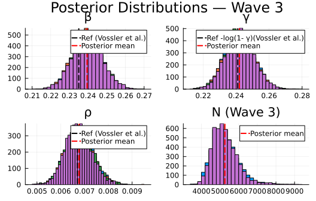
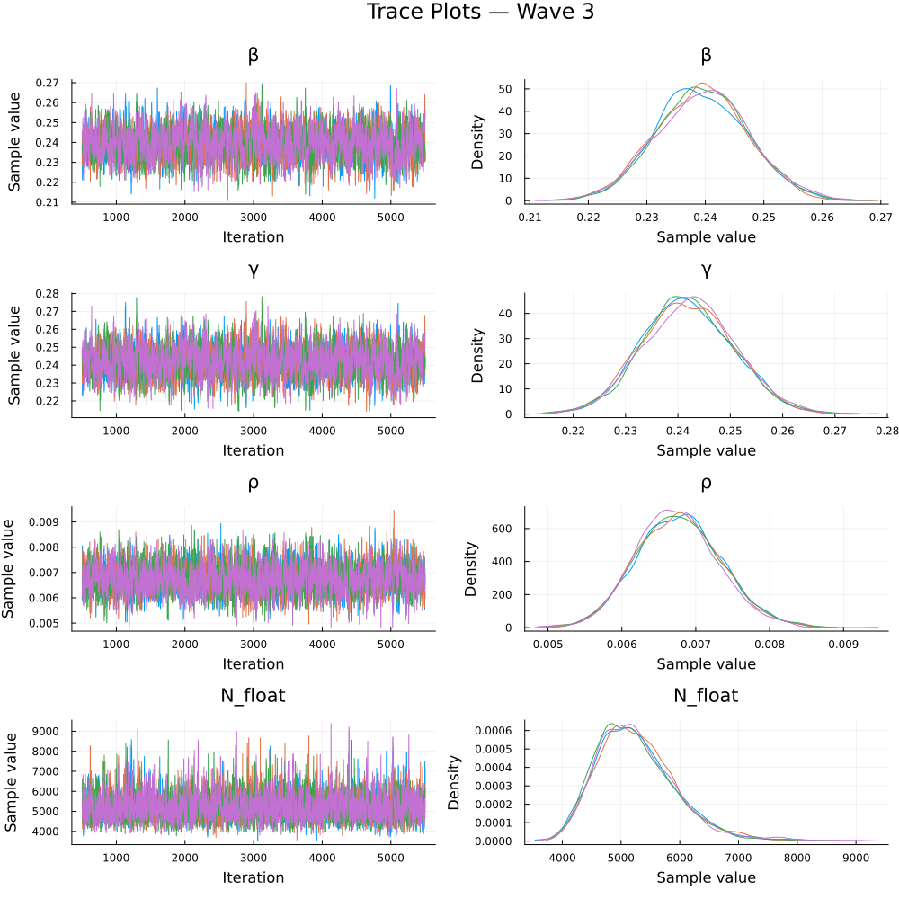
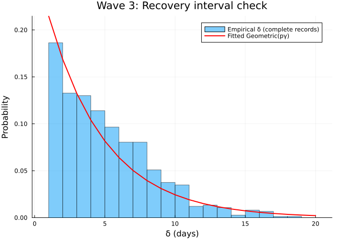
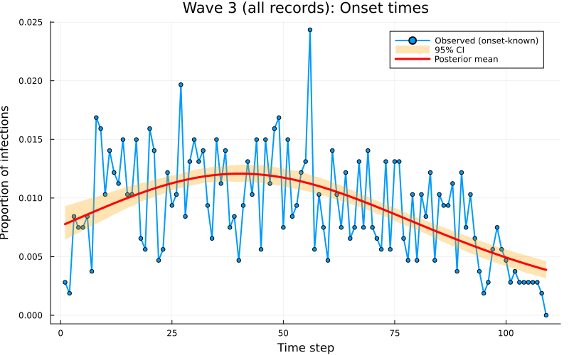

# Inference of an SIR difference equation model using dynamic survival
analysis and Turing.jl - Wave 3 of the Ebola outbreak data
Sandra Montes `(@slmontes)` and Simon Frost `(@sdwfrost)`
2026-04-13

## Introduction

The third and final wave of the 2018–2020 DRC Ebola epidemic shifted
southward to Beni, Kalunguta, and Mandima. This notebook analyses Wave 3
up to 12 September 2019, using 1,069 records with all completeness
categories retained.

Of the 1,069 Wave 3 records, 747 are complete, 321 have known onset but
no recorded hospitalisation, and 1 has hospitalisation but no known
onset. Each group contributes a different likelihood component:

| Group | Count | Likelihood contribution |
|----|----|----|
| Complete (`e1=1, e2=1`) | 747 | Multinomial (onset) + Geometric (recovery) + Binomial |
| Onset-only (`e1=1, e2=0`) | 321 | Multinomial (onset) + Binomial only |
| Hosp-only (`e1=0, e2=1`) | 1 | Convolution over unknown onset + Binomial |

## Libraries

``` julia
using Turing              # For probabilistic programming
using Distributions       # For probability distributions
using SpecialFunctions    # For lgamma (log gamma function)
using Random              # For random number generation
using Plots               # For plotting
using StatsPlots          # For advanced plotting
using MCMCChains          # For handling MCMC output
using Dates               # For now()
using CSV                 # For reading CSV files
using DataFrames          # For data manipulation
using Statistics          # For statistical functions
```

We set a random seed for reproducibility.

``` julia
Random.seed!(1234);
```

## Utility functions

This function converts a rate, `r` over a unit time interval to a
proportion.

``` julia
@inline function rate_to_proportion(r, t=1.0)
    if r < 0 || isnan(r)
        return 0.0
    elseif isinf(r)
        return 1.0
    else
        result = 1 - exp(-r * t)
        return isnan(result) ? 0.0 : max(min(result, 1.0), 0.0)
    end
end;
```

This function evaluates `log(exp(a) + exp(b))` by rescaling around
`max(a,b)`, avoiding underflow when summing many very small
probabilities expressed on the log scale.

``` julia
function logaddexp(a::Real, b::Real)
    m = max(a, b)
    isfinite(m) ? m + log(exp(a - m) + exp(b - m)) : m
end;
```

This function generates a vector of counts from a vector of times and
the total number of timesteps in a simulation.

``` julia
function time_counts(times::AbstractVector{<:Integer}, nsteps::Integer)
    counts = zeros(Int, nsteps)
    @inbounds for t in times
        1 ≤ t ≤ nsteps && (counts[t] += 1)
    end
    return counts
end;
```

## Transitions

We start by defining the deterministic SIR model in discrete time using
a system of difference equations. The model tracks the proportion of
susceptible (S), infected (I), cumulative infections (C), and new
infections per time step (Y).

``` julia
function sir_map!(du, u, p, t)
    (S, I, C, Y) = u
    (β, γ) = p
    infection = rate_to_proportion(β*I)*S     # New infections
    recovery = rate_to_proportion(γ)*I        # New recoveries
    @inbounds begin
        du[1] = S - infection                 # Update susceptibles
        du[2] = I + infection-recovery        # Update infected
        du[3] = C + infection                 # Update cumulative infections
        du[4] = infection                     # Store new infections
    end
    nothing
end;
```

This function solves a map with the above function signature.

``` julia
function solve_map(f, u0, nsteps, p)
    # Pre-allocate array with correct type
    sol = similar(u0, length(u0), nsteps + 1)
    # Initialize the first column with the initial state
    sol[:, 1] = u0
    # Iterate over the time steps
    @inbounds for t in 2:nsteps+1
        u = @view sol[:, t-1] # Get the current state
        du = @view sol[:, t] # Prepare the next state
        f(du, u, p, t)       # Call the function to update du
    end
    return sol
end;
```

Alternatively, we could use the `DifferentialEquations.jl` ecosystem
(via defining a `DiscreteSystem` and solving using `SimpleFunctionMap`
from `SimpleDiffEq.jl`) to simulate the model, although this incurs an
overhead in computational cost, in addition to introducing another
dependency.

This function simulates the SIR model and returns the solution, the
final epidemic size (τ) and the probability distribution of infection
times (f).

``` julia
function simulate(β, γ, ρ, nsteps)
    tspan = (0, nsteps)
    # Preserve type by using zero/one of the promoted type
    T = promote_type(typeof(β), typeof(γ), typeof(ρ))
    zero_T = zero(T)
    one_T = one(T)
    u0 = [one_T - ρ, ρ, zero_T, zero_T] # Initial conditions: S, I, C, Y
    p = [β, γ]
    sol = solve_map(sir_map!, u0, nsteps, p)
    τ = sol[3,end]      # Final size (total infected)
    f = Vector{eltype(sol)}(sol[4,2:end])  # Copy to preserve type
    f = abs.(f)         # Ensure non-negative values
    # Handle edge cases for probability vector 
    if τ <= 0 || any(isnan.(f)) || any(isinf.(f))
        f = fill(one(eltype(f))/nsteps, nsteps)
    else
        f = f/τ         # Normalise frequencies to sum to 1
    end
    return sol, τ, f
end;
```

## Data loading

We load the Ebola outbreak data from `EVD_Wave3.csv`.

``` julia
# Load the data
df_all = CSV.read("EVD_Wave3.csv", DataFrame);

# Split into three groups by data availability
df_complete   = df_all[(df_all.event1 .== 1) .& (df_all.event2 .== 1), :]
df_onset_only = df_all[(df_all.event1 .== 1) .& (df_all.event2 .== 0), :]
df_hosp_only  = df_all[(df_all.event1 .== 0) .& (df_all.event2 .== 1), :]

# Total observed infections for the Binomial final-size term
K_total = nrow(df_all)

# Use all records with a known onset time: complete + onset_only
onset_times_all = vcat(df_complete.onset, df_onset_only.onset)
nsteps = Int(ceil(maximum(onset_times_all))) + 1
ti_onset = max.(1, min.(Int.(round.(onset_times_all)) .+ 1, nsteps))
K_onset  = length(ti_onset)   # used in Multinomial
th_onset = time_counts(ti_onset, nsteps)

# Complete records only: hosp - onset 
raw_delta_complete = df_complete.hosp .- df_complete.onset
@assert all(raw_delta_complete .>= 0) "Found complete records with hosp < onset."
same_day_complete = count(<(1), raw_delta_complete)
delta_complete = max.(1, Int.(round.(raw_delta_complete)))

# The "onset" column for e1=0 records contains the hospitalisation time.
T_hosp_only = max.(1, min.(Int.(round.(df_hosp_only.hosp)) .+ 1, nsteps))

# Minimum N: at least as many susceptibles as total observed infections
N_min = K_total
```

Summary of the loaded data:

    Wave 3 data summary:
      Total records (K_total, Binomial):       1069
      With known onset (K_onset, Multinomial): 1068
        of which complete (e1=1, e2=1):        747
        of which onset-only (e1=1, e2=0):      321
      Hosp-only (e1=0, e2=1, convolution):     1
      nsteps: 109
      Same-day/sub-day complete intervals (<1 day): 101
      Recovery intervals range: 1–20 days

## Turing Model

The Turing.jl probabilistic model for the model, specifies priors,
simulates the difference equations, and defines the likelihood for
observed data by defining the distributions of (a) the total infected
(b) the distribution of infection times, (c) the distribution of
recovery times and (d) the convolution over unknown onset time for
recovery-only records. We place uniform priors on the parameters, as
upper and lower bounds are typically easy for the user to define. Here,
we take advantage of the discrete nature of the data, by fitting a
histogram of the infection times using a multinomial distribution,
rather than a series of categorical distributions.

``` julia
@model function dsa_ebola_allrecords(nsteps::Int,
                                     K_total::Int,
                                     K_onset::Int,
                                     th_onset::Vector{Int},
                                     delta_complete::Vector{Int},
                                     T_hosp_only::Vector{Int},
                                     N_min::Int)

    # Priors for model parameters
    β ~ Uniform(0.01, 1.0)   # Transmission rate 
    γ ~ Uniform(0.01, 1.0)   # Recovery rate 
    ρ ~ Beta(1.0, 500.0)      # Initial infected proportion 

    N_float ~ Uniform(Float64(N_min), Float64(N_min + 20000))
    # Convert to integer for Binomial: use floor and clamp to ensure N >= N_min
    # The conversion is done after sampling, so NUTS can sample continuously
    N = Int(floor(max(Float64(N_min), N_float)))
    
    # Simulate deterministic model 
    _, τ, f = simulate(β, γ, ρ, nsteps)
    
    # Ensure τ is valid for binomial distribution
    τ_valid = clamp(τ, 1e-6, 1.0 - 1e-6)
    
    # Ensure f is valid for multinomial distribution
    f_valid = max.(f, 1e-10)           # Add small positive value to avoid zeros
    f_valid = f_valid / sum(f_valid)   # Normalise
    log_f_valid = log.(f_valid)
    
    # (1) Binomial final-size: all K_total infections
    K_total ~ Binomial(N, τ_valid)

    # (2) Multinomial onset histogram: records with known onset (K_onset)
    th_onset ~ Multinomial(K_onset, f_valid)

    # (3) Geometric recovery intervals: complete records only.
    # Build a 1-indexed geometric by shifting Julia's 0-indexed Geometric(p)
    # so the support matches recovery intervals in days (δ = 1,2,...).
    ϵ  = 1e-8
    pγ = clamp(rate_to_proportion(γ), ϵ, 1 - ϵ)
    G1 = LocationScale(1, 1, Geometric(pγ))
    for i in eachindex(delta_complete)
        delta_complete[i] ~ G1
    end

    # (4) Convolution for hosp-only records: marginalise over unknown onset u.
    #     L_i = Σ_{u=1}^{T_rem-1} f[u] · P(W = T_rem - u), using the same
    #     1-indexed geometric distribution G1 as above.
    for T_rem in T_hosp_only
        u_max = min(T_rem - 1, nsteps)
        log_terms = (log_f_valid[u] + logpdf(G1, T_rem - u) for u in 1:u_max)
        Turing.@addlogprob! foldl(logaddexp, log_terms; init = -Inf)
    end

    return (β=β, γ=γ, ρ=ρ, N=N_float)
end;
```

## Inference

We now perform inference using the Turing model. We start by setting the
number of samples to be used in the sampler and instantiating the model.

``` julia
n_samples = 5000
model = dsa_ebola_allrecords(nsteps, K_total, K_onset,
                              th_onset, delta_complete, T_hosp_only, N_min);
```

Next, we run inference using the No U-Turn Sampler (NUTS).

``` julia
# Warmup
_ = sample(model, NUTS(), 1)
# Run sampler on 4 chains
@time chain = sample(model,
                     NUTS(500, 0.65; max_depth=12, Δ_max=1000.0, init_ϵ=0.2),
                     MCMCThreads(),
                     n_samples,
                     4);
```

We can pass different samplers from `Turing.jl` (e.g. `MH`, `SGLD`,
`HMC`), external samplers (e.g. `DynamicHMC.NUTS`, `AdvancedMH.RWMH`)
via wrapping with `external_sampler`, and can also pass the model to
other packages,
e.g. [`Pathfinder.jl`](https://github.com/mlcolab/Pathfinder.jl).

## Results Analysis

Once we have run the sampler, we can get a summary of the parameter
estimates, along with the expected number of samples.

``` julia
describe(chain)
```

    Chains MCMC chain (5000×18×4 Array{Float64, 3}):

    Iterations        = 501:1:5500
    Number of chains  = 4
    Samples per chain = 5000
    Wall duration     = 795.27 seconds
    Compute duration  = 2531.18 seconds
    parameters        = β, γ, ρ, N_float
    internals         = n_steps, is_accept, acceptance_rate, log_density, hamiltonian_energy, hamiltonian_energy_error, max_hamiltonian_energy_error, tree_depth, numerical_error, step_size, nom_step_size, lp, logprior, loglikelihood

    Summary Statistics

      parameters        mean        std      mcse    ess_bulk    ess_tail      rha ⋯
          Symbol     Float64    Float64   Float64     Float64     Float64   Float6 ⋯

               β      0.2395     0.0079    0.0002   2705.8411   4158.3743    1.001 ⋯
               γ      0.2420     0.0087    0.0002   2555.0536   4296.3077    1.000 ⋯
               ρ      0.0068     0.0006    0.0000   2932.7657   4941.3867    1.000 ⋯
         N_float   5260.1903   684.7645   11.5295   3892.4985   4204.0838    1.000 ⋯

                                                                   2 columns omitted

    Quantiles

      parameters        2.5%       25.0%       50.0%       75.0%       97.5% 
          Symbol     Float64     Float64     Float64     Float64     Float64 

               β      0.2243      0.2341      0.2394      0.2447      0.2550
               γ      0.2253      0.2361      0.2418      0.2478      0.2592
               ρ      0.0057      0.0064      0.0068      0.0071      0.0079
         N_float   4179.5339   4775.3131   5176.8534   5646.7463   6833.2286

NUTS diagnostics:

    NUTS internals available: [:n_steps, :is_accept, :acceptance_rate, :log_density, :hamiltonian_energy, :hamiltonian_energy_error, :max_hamiltonian_energy_error, :tree_depth, :numerical_error, :step_size, :nom_step_size, :lp, :logprior, :loglikelihood]
    Divergent transitions: 0 / 20000
    Max tree depth reached: 12.0
    Step size ε (median [min, max]): 0.00117 [0.00102, 0.00717]

We can also plot posterior distributions for each parameter.

``` julia
β_med = median(chain[:β])
γ_med = median(chain[:γ])
ρ_med = median(chain[:ρ])
N_med = median(chain[:N_float])

# Vossler et al. (2022) Wave 1 reference values
p1 = histogram(chain[:β], label="", title="β", density=true)
vline!(p1, [0.235], label="Ref (Vossler et al.)", color=:black, linestyle=:dash, linewidth=2)
vline!(p1, [β_med], label="Posterior median", color=:red, linestyle=:dash, linewidth=2)

p2 = histogram(chain[:γ], label="", title="γ", density=true)
vline!(p2, [0.241], label="Ref -log(1- γ)(Vossler et al.)", color=:black, linestyle=:dash, linewidth=2)
vline!(p2, [γ_med], label="Posterior median", color=:red, linestyle=:dash, linewidth=2)

p3 = histogram(chain[:ρ], label="", title="ρ", density=true)
vline!(p3, [0.0067], label="Ref (Vossler et al.)", color=:black, linestyle=:dash, linewidth=2)
vline!(p3, [ρ_med], label="Posterior median", color=:red, linestyle=:dash, linewidth=2)

# N is wave-specific
p4 = histogram(chain[:N_float], label="", title="N (Wave 3)", density=true, bins=50)
vline!(p4, [N_med], label="Posterior median", color=:red, linestyle=:dash, linewidth=2)

plot(p1, p2, p3, p4, layout=(2,2), plot_title="Posterior Distributions — Wave 3")
```



Plot trace plots for MCMC diagnostics.

``` julia
plot(chain, plot_title="Trace Plots — Wave 3")
```



## Parameter Estimates

We summarise the posterior estimates for the model parameters.

``` julia
β_chain  = vec(chain[:β])
γ_chain  = vec(chain[:γ])
ρ_chain  = vec(chain[:ρ])
N_chain  = vec(chain[:N_float])
pγ_chain = rate_to_proportion.(γ_chain)

R0_chain       = β_chain ./ pγ_chain           # R0 of the discrete process
IP_steps_chain = 1 ./ pγ_chain                 # mean infectious period in steps (1-indexed Geometric)
I0_chain       = ρ_chain .* N_chain            # implied initial infected count
tau_chain      = K_total ./ N_chain            # observed attack rate posterior

# Posterior point estimates (medians)
β_post  = median(β_chain)
γ_post  = median(γ_chain)
ρ_post  = median(ρ_chain)
N_post  = median(N_chain)
pγ_post = rate_to_proportion(γ_post)

function posterior_summary(x; digits=4)
    (median = round(median(x); digits=digits),
     mean   = round(mean(x);   digits=digits),
     q025   = round(quantile(x, 0.025); digits=digits),
     q975   = round(quantile(x, 0.975); digits=digits))
end

posterior_table = (
    N         = posterior_summary(N_chain;        digits=0),
    β         = posterior_summary(β_chain;        digits=4),
    γ         = posterior_summary(γ_chain;        digits=4),
    ρ         = posterior_summary(ρ_chain;        digits=5),
    R0        = posterior_summary(R0_chain;       digits=3),
    IP_steps  = posterior_summary(IP_steps_chain; digits=2),
    I0        = posterior_summary(I0_chain;       digits=2),
    K_over_N  = posterior_summary(tau_chain;      digits=4),
)
```

    (N = (median = 5177.0, mean = 5260.0, q025 = 4180.0, q975 = 6833.0), β = (median = 0.2394, mean = 0.2395, q025 = 0.2243, q975 = 0.255), γ = (median = 0.2418, mean = 0.242, q025 = 0.2253, q975 = 0.2592), ρ = (median = 0.00676, mean = 0.00677, q025 = 0.0057, q975 = 0.00794), R0 = (median = 1.114, mean = 1.114, q025 = 1.077, q975 = 1.152), IP_steps = (median = 4.66, mean = 4.66, q025 = 4.38, q975 = 4.96), I0 = (median = 35.23, mean = 35.41, q025 = 28.35, q975 = 43.62), K_over_N = (median = 0.2065, mean = 0.2065, q025 = 0.1564, q975 = 0.2558))

    N           median = 5177.0   mean = 5260.0   95% CI = [4180.0, 6833.0]
    β           median = 0.2394   mean = 0.2395   95% CI = [0.2243, 0.255]
    γ           median = 0.2418   mean = 0.242   95% CI = [0.2253, 0.2592]
    ρ           median = 0.00676   mean = 0.00677   95% CI = [0.0057, 0.00794]
    R0          median = 1.114   mean = 1.114   95% CI = [1.077, 1.152]
    IP_steps    median = 4.66   mean = 4.66   95% CI = [4.38, 4.96]
    I0          median = 35.23   mean = 35.41   95% CI = [28.35, 43.62]
    K_over_N    median = 0.2065   mean = 0.2065   95% CI = [0.1564, 0.2558]

    Vossler et al. (2022) Wave 3 reference (continuous-time, β/γ):
      β = 0.235, γ = 0.214, ρ = 0.0067, β/γ = 1.098, 1/γ = 4.7 d

## Recovery interval fit check

``` julia
# Empirical δ histogram vs fitted Geometric(pγ_post) PMF (1-indexed)
δ = delta_complete
kmax = maximum(δ)
ks = 1:kmax
pmf = pdf.(LocationScale(1, 1, Geometric(pγ_post)), ks)

pδ = histogram(δ;
    normalize=true,
    bins=1:kmax,
    alpha=0.5,
    label="Empirical δ (complete records)",
    xlabel="δ (days)",
    ylabel="Probability",
    title="Wave 3: Recovery interval check"
)
plot!(pδ, ks, pmf; linewidth=2, color=:red, label="Fitted Geometric(pγ)")
pδ
```



## Epidemic curve

``` julia
sol, τ, f = simulate(β_post, γ_post, ρ_post, nsteps)

n_samples_ci = min(500, length(chain[:β]))
sample_idx   = rand(1:length(chain[:β]), n_samples_ci)
f_samples    = Matrix{Float64}(undef, nsteps, n_samples_ci)
for (idx, i) in enumerate(sample_idx)
    _, _, f_i = simulate(chain[:β][i], chain[:γ][i], chain[:ρ][i], nsteps)
    f_samples[:, idx] = f_i
end
f_median = [quantile(f_samples[t, :], 0.5)   for t in 1:nsteps]
f_lower  = [quantile(f_samples[t, :], 0.025) for t in 1:nsteps]
f_upper  = [quantile(f_samples[t, :], 0.975) for t in 1:nsteps]

p1 = plot(1:nsteps, th_onset ./ K_onset,
          label="Observed (onset-known)",
          title="Wave 3 (all records): Onset times",
          xlabel="Time step", ylabel="Proportion of infections",
          linewidth=2, marker=:circle, markersize=3)
plot!(p1, 1:nsteps, f_lower,
      fillrange=f_upper, fillalpha=0.3, fillcolor=:orange,
      linecolor=:orange, label="95% CrI", linewidth=0)
plot!(p1, 1:nsteps, f_median, label="Posterior median", linewidth=3, color=:red)
plot(p1, size=(800, 500))
```



## Discussion

Across all three waves, DDSA reproduces the key epidemiological trend
identified by Vossler et al. (2022). The framework stays stable under
different data-completeness profiles across waves (Wave 1: 24.5%
onset-only, Wave 2: 35.5%, Wave 3: 30.0%), because each record type is
mapped to an explicit likelihood contribution rather than handled by ad
hoc imputation. Together, these findings indicate that for outbreak line
lists reported in daily calendar time, DDSA offers an
observation-consistent alternative to continuous-time implementations.
