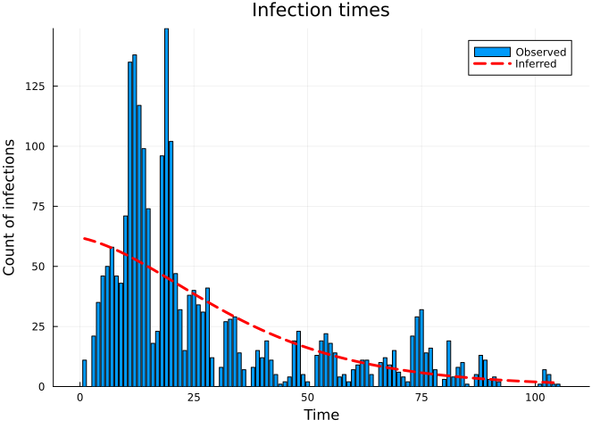
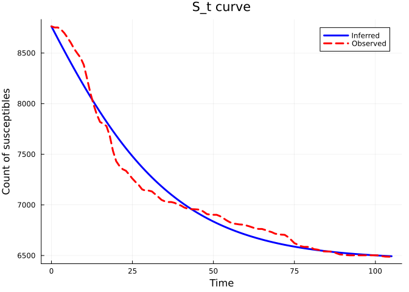
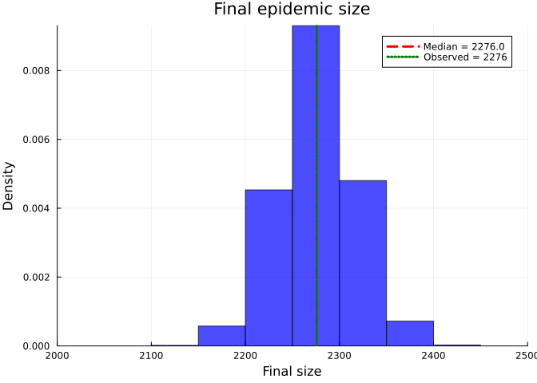

# Inference using dynamic survival analysis and Turing.jl: WSU Data
Simon Frost (@sdwfrost), Sandra Montes (@slmontes)
2025-08-15

## Introduction

In this example, we use a discrete-time SIR model and Turing.jl to infer
the susceptible population $N$, the transmission rate ($\beta$),
recovery-rate parameter ($\gamma$), and the initial infected proportion
($\rho$) from line-list data. This dataset originates from a study
conducted on the H1N1 outbreak at Washington State University (WSU) in
2009, recording the number of daily cases over a period of 105 days. The
dataset was obtained from [KhudaBukhsh et
al. (2019)](https://github.com/cbskust/SDS.Epidemic/tree/master). The
original raw data only included daily counts of new infections;
KhudaBukhsh et al. reconstructed individual infection times from those
counts and generated individual recovery times by sampling from an
exponential distribution with rate $\gamma$ fixed at $1/5.5$ per day,
the mean of prior infectious-period estimates. The resulting dataset
(WSU.csv) contains individual-level infection times (first column) and
recovery times (second column) for 2,276 cases, including 10 individuals
whose recovery occurred after the 105-day observation window and are
therefore treated as right-censored.

## Libraries

``` julia
using Distributions
using Turing
using StatsPlots
using Plots
using Statistics
using Random
using CSV
using DataFrames
using MCMCDiagnosticTools
```

Set random seed for reproducibility

``` julia
seed = 1234
Random.seed!(seed)
```

## Utility functions

``` julia
"""
Convert a rate to a probability over time t.
"""
@inline function rate_to_proportion(r, t=1.0)
    if r < 0 || isnan(r)
        return 0.0
    elseif isinf(r)
        return 1.0
    else
        result = 1 - exp(-r * t)
        return isnan(result) ? 0.0 : max(min(result, 1.0), 0.0)
    end
end

"""
Generate a vector of counts from a vector of times and the total number of timesteps.
"""
function time_counts(times::AbstractVector{<:Integer}, nsteps::Integer)
    counts = zeros(Int, nsteps)
    @inbounds for t in times
        1 ≤ t ≤ nsteps && (counts[t] += 1)
    end
    return counts
end

"""
Prepare real data from DataFrame for analysis.
"""
function prep_sds(df::DataFrame, Tmax)
    ti     = Float64[]
    delta  = Float64[]
    cens   = Bool[]
    for r in eachrow(df)
        t_inf, t_rec = r[1], r[2]
        t_inf ≥ Tmax && continue                # infection after cut-off - ignore
        
        # Calculate recovery interval
        recovery_interval = t_rec - t_inf
        
        # Only include valid recovery intervals 
        if recovery_interval > 0
            push!(ti, t_inf)
            if t_rec < Tmax                        # full recovery observed
                push!(delta, recovery_interval)
                push!(cens, false)
            else                                   # right-censored
                push!(delta, Tmax - t_inf)
                push!(cens, true)
            end
        end
    end
    return ti, delta, cens
end

"""
Load and prepare real epidemic data from WSU.csv file.
"""
function load_real_data(csv_file::String, Tmax::Float64)
    # Load the data
    df = CSV.read(csv_file, DataFrame)
    
    # Prepare the data 
    ti, delta, cens = prep_sds(df, Tmax)
    
    # Convert to appropriate format for analysis
    K = length(ti)  # Total number of infections
    
    # Convert infection times to discrete time steps 
    ti_discrete = clamp.(round.(Int, ti) .+ 1, 1, 1_000_000) #So day 0 isn't dropped
    nsteps = max(maximum(ti_discrete), 105) # 105 days of data
    
    # Create histogram of infection times
    th = time_counts(ti_discrete, nsteps)
    
    # Convert recovery intervals to integers (rounding to nearest day)
    delta_discrete = max.(1, round.(Int, delta))
    @assert sum(th) == K "sum(th) must equal K, check infection day discretisation"
    
    return Dict(
        :K => K,
        :ti => ti_discrete,
        :delta => delta_discrete,
        :th => th,
        :nsteps => nsteps,
        :cens => cens,
        :ti_original => ti,
        :delta_original => delta
    )
end
```

## SIR model

The model is a discrete-time SIR model with geometric recovery times. In
this model we assume that the recovery time is the same for all
individuals and that the recovery time is independent of the infection
time.

``` julia
function sir_map!(du, u, p, t)
    (S, I, C, Y) = u
    (β, γ) = p
    infection = rate_to_proportion(β*I)*S     # New infections
    recovery = rate_to_proportion(γ)*I        # New recoveries
    @inbounds begin
        du[1] = S - infection                 # Update susceptibles
        du[2] = I + infection-recovery        # Update infected
        du[3] = C + infection                 # Update cumulative infections
        du[4] = infection                     # Store new infections
    end
    nothing
end

function solve_map(f, u0, nsteps, p)
    # Pre-allocate array 
    sol = similar(u0, length(u0), nsteps + 1)
    # Initialise the first column with the initial state
    sol[:, 1] = u0
    # Iterate over the time steps
    @inbounds for t in 2:nsteps+1
        u = @view sol[:, t-1] # Get the current state
        du = @view sol[:, t]  # Prepare the next state
        f(du, u, p, t)        # Call the function to update du
    end
    return sol
end

function simulate(β, γ, ρ, nsteps)
    tspan = (0, nsteps)
    u0 = [1-ρ, ρ, 0.0, 0.0] # Initial conditions: S, I, C, Y
    p = [β, γ]
    sol = solve_map(sir_map!, u0, nsteps, p)
    τ = sol[3,end]      # Final size (total infected)
    f = sol[4,2:end]    # New infections per time step
    f = abs.(f)         # Ensure non-negative values
    # Handle edge cases 
    if τ <= 0 || any(isnan.(f)) || any(isinf.(f))
        f = fill(one(eltype(f))/nsteps, nsteps)
    else
        f = f./τ         # Normalise frequencies
    end 
    return sol, τ, f
end
```

## Data loading and preparation

Load the WSU data and prepare the data for inference.

``` julia
Tmax = 105.0
real_data = load_real_data("WSU.csv", Tmax)
```

Plot of the infection time observations

``` julia
bar(0:(real_data[:nsteps] - 1), real_data[:th], title="Infection time observations", xlabel="Time step", ylabel="Observations", legend=false)
```


    Total infections: 2276
    Time steps: 105
    Number of censored observations: 10
    Mean infection time: 26.64
    Mean recovery interval: 5.0
    Peak infections: 149 at time step 19

## Turing model

The Turing.jl probabilistic model used to infer the parameters from this
dataset employs the previously defined discrete-time SIR model.

``` julia
@model function dsa_discrete_turing_multinomial_inferN(
                                   N_max::Int,              # Upper bound for susceptible population (e.g. total student body)
                                   nsteps::Int,             # Number of time steps
                                   K::Int,                  # Observed total infections
                                   th::Vector{Int},         # Histogram of infection times
                                   delta::Vector{Int},      # Observed recovery intervals
                                   cens::Vector{Bool})      # Censoring (true=right-censored)
    
    # Priors for model parameters
    N ~ DiscreteUniform(K + 1, N_max)   # Susceptible pool
    β ~ Uniform(0.01, 5.0)   # Transmission rate 
    γ ~ truncated(LogNormal(log(1/5.5), 0.3), 0.01, 1.0)   # Recovery rate 
    ρ ~ Beta(0.01, 1.0)      # Initial infected proportion 
    
    # Simulate deterministic model 
    _, τ, f = simulate(β, γ, ρ, nsteps)
    
    # Ensure τ is valid for binomial distribution
    τ_valid = max(min(τ, 1.0), 0.0)
    
    # Ensure f is valid for multinomial distribution
    f_valid = max.(f, 1e-10)           # Add small positive value to avoid zeros
    f_valid = f_valid ./ sum(f_valid)   # Normalise
    
    # Likelihood for number of infections
    K ~ Binomial(N, τ_valid)
    
    # Likelihood for infection times 
    th ~ Multinomial(K, f_valid)
    
    # Likelihood for recovery times 
    ϵ = 1e-8
    pγ = rate_to_proportion(γ)
    pγ_valid = min(max(pγ, ϵ), 1 - ϵ)
    log_surv = log1p(-pγ_valid)
    for i in eachindex(delta)
        if cens[i]
            Turing.@addlogprob!(delta[i] * log_surv)  # log P(not yet recovered by step delta[i])
        else
            delta[i] ~ Geometric(pγ_valid)
        end
    end
    
    return (N=N, β=β, γ=γ, ρ=ρ)
end
```

Model parameters:

``` julia
N_max = 18000   # WSU total student body (KhudaBukhsh et al. (2020))

th = real_data[:th]         # Infection times
K = sum(th)                 # Total infections
delta = real_data[:delta]   # Recovery intervals
cens  = real_data[:cens]    # Censoring
nsteps = real_data[:nsteps] # Number of time steps
```

## Running the inference

``` julia
model = dsa_discrete_turing_multinomial_inferN(N_max, nsteps, K, th, delta, cens);

n_samples  = 8000
nuts_adapt = 2000
n_chains   = 4
σ_N        = 1000  # Discrete random walk for N with a window ±σ_N 
N_proposal(vnt) = (n = vnt[@varname(N)];
                   DiscreteUniform(max(K + 1, n - σ_N), min(N_max, n + σ_N)))

gibbs_sampler = Gibbs(
    :N => MH(:N => N_proposal),
    (:β, :γ, :ρ) => NUTS(nuts_adapt, 0.8; max_depth=12, Δ_max=1000.0)
)

# Different initial values per chain (wide range for N, small offsets for β/γ/ρ)
# to improve exploration
init_params_vec = [
    (N = round(Int, 4_000 + 4_000 * (i - 1)),
     β = 0.15 + 0.03 * (i - 1) / max(n_chains - 1, 1),
     γ = 0.16 + 0.04 * (i - 1) / max(n_chains - 1, 1),
     ρ = 0.03 + 0.03 * (i - 1) / max(n_chains - 1, 1))
    for i in 1:n_chains
]

_ = sample(model, gibbs_sampler, 1; progress=false, initial_params=init_params_vec[1])

@time chain = sample(model, gibbs_sampler, MCMCThreads(), n_samples, n_chains;
                     progress=false, initial_params=init_params_vec);
```

## Results

Once we have run the sampler, we can get a summary of the parameter
estimates

``` julia
describe(chain)
```

    Chains MCMC chain (8000×7×4 Array{Float64, 3}):

    Iterations        = 1:1:8000
    Number of chains  = 4
    Samples per chain = 8000
    Wall duration     = 10.48 seconds
    Compute duration  = 37.12 seconds
    parameters        = N, β, γ, ρ
    internals         = logprior, loglikelihood, logjoint

    Summary Statistics

      parameters        mean         std       mcse   ess_bulk   ess_tail      rha ⋯
          Symbol     Float64     Float64    Float64    Float64    Float64   Float6 ⋯

               N   9429.4905   1548.5969   148.8876   109.3918   144.0369    1.041 ⋯
               β      0.1697      0.0069     0.0006   153.1045   196.8317    1.015 ⋯
               γ      0.1784      0.0039     0.0002   499.9142   614.5984    1.015 ⋯
               ρ      0.0412      0.0039     0.0004   126.9735   220.5716    1.040 ⋯

                                                                   2 columns omitted

    Quantiles

      parameters        2.5%       25.0%       50.0%        75.0%        97.5% 
          Symbol     Float64     Float64     Float64      Float64      Float64 

               N   7017.0000   8348.0000   9143.0000   10290.0000   13331.0000
               β      0.1555      0.1653      0.1697       0.1743       0.1830
               γ      0.1709      0.1757      0.1783       0.1809       0.1863
               ρ      0.0331      0.0386      0.0415       0.0440       0.0483

Plot trace plots for MCMC diagnostics

``` julia
plot(chain, plot_title="Trace plots")
```


Extract parameter estimates median values

``` julia
# Extract parameter estimates
N_post = round(Int, median(chain[:N]))
β_post = median(chain[:β])
γ_post = median(chain[:γ])
ρ_post = median(chain[:ρ])
```

Posterior summaries with 95% credible intervals. Derived quantities (R₀
and mean infectious period) are computed sample-by-sample from the
chain.

``` julia
N_chain  = vec(chain[:N])
β_chain  = vec(chain[:β])
γ_chain  = vec(chain[:γ])
ρ_chain  = vec(chain[:ρ])
pγ_chain = rate_to_proportion.(γ_chain)

R0_chain       = β_chain ./ pγ_chain   # R0 of the discrete process = β / (1 - exp(-γ))
IP_steps_chain = 1 ./ pγ_chain         # mean infectious period in steps (geometric, the actual fitted process)
tau_chain      = K ./ N_chain          # observed attack rate posterior

function posterior_summary(x; digits=4)
    (median = round(median(x); digits=digits),
     mean   = round(mean(x);   digits=digits),
     q025   = round(quantile(x, 0.025); digits=digits),
     q975   = round(quantile(x, 0.975); digits=digits))
end

posterior_table = (
    N         = posterior_summary(N_chain; digits=0),
    β         = posterior_summary(β_chain),
    γ         = posterior_summary(γ_chain),
    ρ         = posterior_summary(ρ_chain),
    R0        = posterior_summary(R0_chain),
    IP_steps  = posterior_summary(IP_steps_chain; digits=2),
    K_over_N  = posterior_summary(tau_chain),
)
```

    (N = (median = 9143.0, mean = 9429.0, q025 = 7017.0, q975 = 13331.0), β = (median = 0.1697, mean = 0.1697, q025 = 0.1555, q975 = 0.183), γ = (median = 0.1783, mean = 0.1784, q025 = 0.1709, q975 = 0.1863), ρ = (median = 0.0415, mean = 0.0412, q025 = 0.0331, q975 = 0.0483), R0 = (median = 1.0393, mean = 1.039, q025 = 0.9576, q975 = 1.123), IP_steps = (median = 6.12, mean = 6.12, q025 = 5.88, q975 = 6.37), K_over_N = (median = 0.2489, mean = 0.2475, q025 = 0.1707, q975 = 0.3244))

    N           median = 9143.0   mean = 9429.0   95% CI = [7017.0, 13331.0]
    β           median = 0.1697   mean = 0.1697   95% CI = [0.1555, 0.183]
    γ           median = 0.1783   mean = 0.1784   95% CI = [0.1709, 0.1863]
    ρ           median = 0.0415   mean = 0.0412   95% CI = [0.0331, 0.0483]
    R0          median = 1.0393   mean = 1.039   95% CI = [0.9576, 1.123]
    IP_steps    median = 6.12   mean = 6.12   95% CI = [5.88, 6.37]
    K_over_N    median = 0.2489   mean = 0.2475   95% CI = [0.1707, 0.3244]

    Convergence diagnostics:

    ESS

      parameters        ess   ess_per_sec 
          Symbol    Float64       Float64 

               N   109.3918        2.9467
               β   153.1045        4.1241
               γ   499.9142       13.4661
               ρ   126.9735        3.4203

    R-hat

      parameters      rhat 
          Symbol   Float64 

               N    1.0413
               β    1.0150
               γ    1.0156
               ρ    1.0407

Plot model fit




    Final epidemic size (simulated, at median N): τ * N̂ = 2270.1
    Total observed infections: 2276
    Inferred susceptible population (median): N̂ = 9143
    Mean recovery time (observed delta, hosp - onset): 5.0 days
    Mean recovery delta (fitted, (1 - p_γ̂)/p_γ̂): 5.12 days
    Observed total infections: 2276
    Predicted total infections: 2270.1
    Recovery delta fit error (observed vs (1-p_γ̂)/p_γ̂): 0.8%

## Comparison to KhudaBukhsh et al. (2019) results

We plot the S_t curve and the final epidemic size distribution to
compare our observed and simulated data, with that obtained in
KhudaBukhsh et al. (2019).





    Final size posterior: 
    median = 2276.0   
    95% CI = [2197.0, 2358.0]

## Discussion

The analysis performed on the WSU H1N1 outbreak dataset from 2009 showed
that the discrete SIR model, with geometric recovery times, captured the
dynamics of the epidemic. The susceptible population $N$ has a posterior
median of $9{,}143$ (95% CI $[7{,}017,\,13{,}331]$), which overlaps the
estimate of $7{,}051$ (90% CI $[6{,}602,\,7{,}581]$) reported by
KhudaBukhsh et al. (2020).

This approach offers several advantages: a simple and interpretable
modelling framework, fast computation and inference through Turing.jl,
and clear parameter interpretation (transmission rate β, recovery rate
γ, and initial infected proportion ρ). However, it’s important to note
that the model relies on key assumptions, including geometric recovery
times and the modification of the original dataset to include recovery
intervals, as the primary data only contained daily infection counts.
