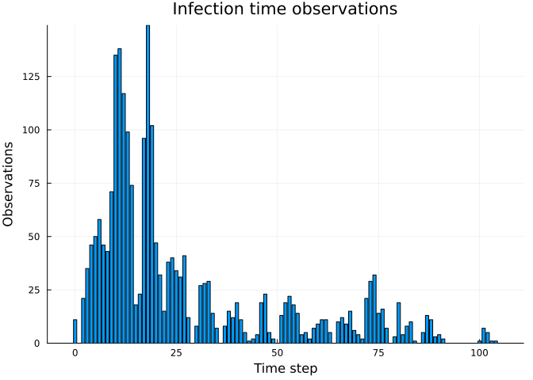
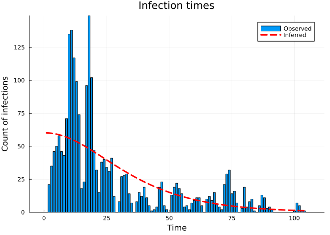
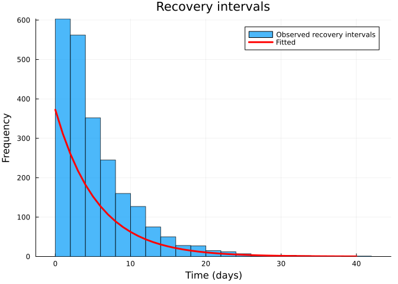
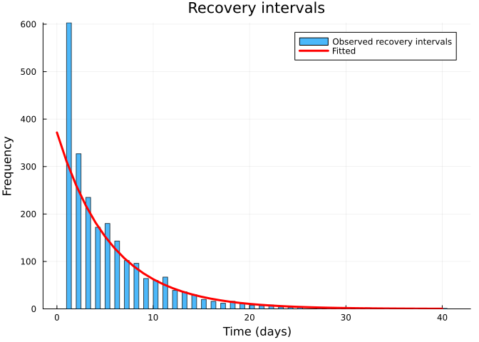
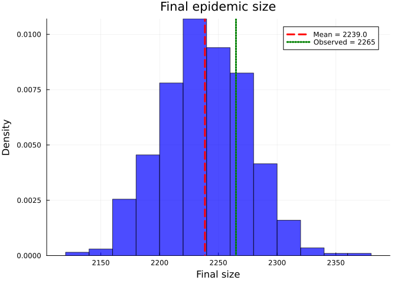

# Inference using dynamic survival analysis and Turing.jl: WSU Data
Simon Frost (@sdwfrost), Sandra Montes (@slmontes)
2025-08-15

## Introduction

In this example, we use a discrete-time SIR model and Turing.jl to infer
key epidemiological parameters from a dataset. This dataset originates
from a study conducted on the H1N1 outbreak at Washington State
University (WSU) in 2009, recording the number of daily cases over a
period of 105 days. The dataset was obtained from [KhudaBukhsh et
al. (2019)](https://github.com/cbskust/SDS.Epidemic/tree/master). They
modified the original raw data, that only included daily counts of new
infections, by reconstructing individual infection times from the daily
case counts and generating individual recovery times from a Gamma
distribution fitted to the recovery process. The resulting dataset
(WSU.csv) contains individual-level infection times (first column) and
recovery times (second column) for 2,276 cases, including 10 individuals
whose recovery occurred after the 105-day observation window and are
therefore treated as right-censored.

## Libraries

``` julia
using Distributions
using Turing
using StatsPlots
using Plots
using Statistics
using Random
using CSV
using DataFrames
using MCMCDiagnosticTools
```

Set random seed for reproducibility

``` julia
seed = 1234
Random.seed!(seed)
```

## Utility functions

``` julia
"""
Convert a rate to a probability over time t.
"""
@inline function rate_to_proportion(r, t=1.0)
    if r < 0 || isnan(r)
        return 0.0
    elseif isinf(r)
        return 1.0
    else
        result = 1 - exp(-r * t)
        return isnan(result) ? 0.0 : max(min(result, 1.0), 0.0)
    end
end

"""
Generate a vector of counts from a vector of times and the total number of timesteps.
"""
function time_counts(times::AbstractVector{<:Integer}, nsteps::Integer)
    counts = zeros(Int, nsteps)
    @inbounds for t in times
        1 ≤ t ≤ nsteps && (counts[t] += 1)
    end
    return counts
end

"""
Prepare real data from DataFrame for analysis.
"""
function prep_sds(df::DataFrame, Tmax)
    ti     = Float64[]
    delta  = Float64[]
    cens   = Bool[]
    for r in eachrow(df)
        t_inf, t_rec = r[1], r[2]
        t_inf ≥ Tmax && continue                # infection after cut-off - ignore
        
        # Calculate recovery interval
        recovery_interval = t_rec - t_inf
        
        # Only include valid recovery intervals 
        if recovery_interval > 0
            push!(ti, t_inf)
            if t_rec < Tmax                        # full recovery observed
                push!(delta, recovery_interval)
                push!(cens, false)
            else                                   # right-censored
                push!(delta, Tmax - t_inf)
                push!(cens, true)
            end
        end
    end
    return ti, delta, cens
end

"""
Load and prepare real epidemic data from WSU.csv file.
"""
function load_real_data(csv_file::String, Tmax::Float64)
    # Load the data
    df = CSV.read(csv_file, DataFrame)
    
    # Prepare the data 
    ti, delta, cens = prep_sds(df, Tmax)
    
    # Convert to appropriate format for analysis
    K = length(ti)  # Total number of infections
    
    # Convert infection times to discrete time steps 
    ti_discrete = round.(Int, ti)
    nsteps = max(maximum(ti_discrete), 105) # 105 days of data
    
    # Create histogram of infection times
    th = time_counts(ti_discrete, nsteps)
    
    # Convert recovery intervals to integers (rounding to nearest day)
    delta_discrete = round.(Int, delta)
    
    return Dict(
        :K => K,
        :ti => ti_discrete,
        :delta => delta_discrete,
        :th => th,
        :nsteps => nsteps,
        :cens => cens,
        :ti_original => ti,
        :delta_original => delta
    )
end
```

## SIR model

The model is a discrete-time SIR model with geometric recovery times. In
this model we assume that the recovery time is the same for all
individuals and that the recovery time is independent of the infection
time.

``` julia
function sir_map!(du, u, p, t)
    (S, I, C, Y) = u
    (β, γ) = p
    infection = rate_to_proportion(β*I)*S     # New infections
    recovery = rate_to_proportion(γ)*I        # New recoveries
    @inbounds begin
        du[1] = S - infection                 # Update susceptibles
        du[2] = I + infection-recovery        # Update infected
        du[3] = C + infection                 # Update cumulative infections
        du[4] = infection                     # Store new infections
    end
    nothing
end

function solve_map(f, u0, nsteps, p)
    # Pre-allocate array 
    sol = similar(u0, length(u0), nsteps + 1)
    # Initialise the first column with the initial state
    sol[:, 1] = u0
    # Iterate over the time steps
    @inbounds for t in 2:nsteps+1
        u = @view sol[:, t-1] # Get the current state
        du = @view sol[:, t]  # Prepare the next state
        f(du, u, p, t)        # Call the function to update du
    end
    return sol
end

function simulate(β, γ, ρ, nsteps)
    tspan = (0, nsteps)
    u0 = [1-ρ, ρ, 0.0, 0.0] # Initial conditions: S, I, C, Y
    p = [β, γ]
    sol = solve_map(sir_map!, u0, nsteps, p)
    τ = sol[3,end]      # Final size (total infected)
    f = sol[4,2:end]    # New infections per time step
    f = abs.(f)         # Ensure non-negative values
    # Handle edge cases 
    if τ <= 0 || any(isnan.(f)) || any(isinf.(f))
        f = fill(one(eltype(f))/nsteps, nsteps)
    else
        f = f/τ         # Normalise frequencies to sum to 1
    end
    return sol, τ, f
end
```

## Data loading and preparation

Load the WSU data and prepare the data for inference.

``` julia
Tmax = 105.0
real_data = load_real_data("WSU.csv", Tmax)
```

Plot of the infection time observations

``` julia
bar(1:real_data[:nsteps], real_data[:th], title="Infection time observations", xlabel="Time step", ylabel="Observations", legend=false)
```



    Total infections: 2276
    Time steps: 105
    Number of censored observations: 10
    Mean infection time: 26.64
    Mean recovery interval: 5.0
    Peak infections: 149 at time step 18

## Turing model

The Turing.jl probabilistic model used to infer the parameters from this
dataset employs the previously defined discrete-time SIR model.

``` julia
@model function dsa_discrete_turing_multinomial(N::Int,     # Initial susceptibles 
                                   M::Int,                  # Initial infected 
                                   nsteps::Int,             # Number of time steps
                                   K::Int,                  # Observed total infections
                                   th::Vector{Int},         # Histogram of infection times
                                   delta::Vector{Int},      # Observed recovery intervals
                                   cens::Vector{Bool})      # Censoring (true=right-censored)
    
    # Priors for model parameters
    β ~ Uniform(0.01, 5.0)   # Transmission rate 
    γ ~ Uniform(0.01, 1.0)   # Recovery rate 
    ρ ~ Beta(0.01, 1.0)      # Initial infected proportion 
    
    # Simulate deterministic model 
    _, τ, f = simulate(β, γ, ρ, nsteps)
    
    # Ensure τ is valid for binomial distribution
    τ_valid = max(min(τ, 1.0), 0.0)
    
    # Ensure f is valid for multinomial distribution
    f_valid = max.(f, 1e-10)           # Add small positive value to avoid zeros
    f_valid = f_valid / sum(f_valid)   # Normalise
    
    # Likelihood for number of infections
    K ~ Binomial(N, τ_valid)
    
    # Likelihood for infection times 
    th ~ Multinomial(K, f_valid)
    
    # Likelihood for recovery times 
    ϵ = 1e-8
    pγ = rate_to_proportion(γ)
    pγ_valid = min(max(pγ, ϵ), 1 - ϵ)
    log_surv = log1p(-pγ_valid)
    for i in 1:length(delta)
        if cens[i]
            Turing.@addlogprob!(delta[i] * log_surv)  # log P(not yet recovered by step delta[i])
        else
            delta[i] ~ Geometric(pγ_valid)
        end
    end
    
    return (β=β, γ=γ, ρ=ρ)
end
```

Model parameters:

``` julia
N = 7250   # Population size
M = 1      # Initial infected

th = real_data[:th]         # Infection times
K = sum(th)                 # Total infections
delta = real_data[:delta]   # Recovery intervals
cens  = real_data[:cens]    # Censoring
nsteps = real_data[:nsteps] # Number of time steps
```

## Running the inference

``` julia
model = dsa_discrete_turing_multinomial(N, M, nsteps, K, th, delta, cens);

n_samples = 1000;
_ = sample(model, NUTS(), 1)
@time chain = sample(model,
                     NUTS(500, 0.65; max_depth=10, Δ_max=1000.0, init_ϵ=0.2),
                     n_samples);
```

## Results

Once we have run the sampler, we can get a summary of the parameter
estimates

``` julia
describe(chain)
```

    Chains MCMC chain (1000×17×1 Array{Float64, 3}):

    Iterations        = 501:1:1500
    Number of chains  = 1
    Samples per chain = 1000
    Wall duration     = 0.87 seconds
    Compute duration  = 0.87 seconds
    parameters        = β, γ, ρ
    internals         = n_steps, is_accept, acceptance_rate, log_density, hamiltonian_energy, hamiltonian_energy_error, max_hamiltonian_energy_error, tree_depth, numerical_error, step_size, nom_step_size, logprior, loglikelihood, logjoint

    Summary Statistics

      parameters      mean       std      mcse   ess_bulk   ess_tail      rhat   e ⋯
          Symbol   Float64   Float64   Float64    Float64    Float64   Float64     ⋯

               β    0.1803    0.0037    0.0002   320.9411   358.8715    1.0011     ⋯
               γ    0.1787    0.0035    0.0002   322.2589   396.3053    1.0014     ⋯
               ρ    0.0486    0.0020    0.0001   439.7394   439.1222    1.0001     ⋯

                                                                    1 column omitted

    Quantiles

      parameters      2.5%     25.0%     50.0%     75.0%     97.5% 
          Symbol   Float64   Float64   Float64   Float64   Float64 

               β    0.1734    0.1778    0.1802    0.1826    0.1881
               γ    0.1721    0.1762    0.1787    0.1809    0.1859
               ρ    0.0448    0.0472    0.0484    0.0500    0.0529

Plot trace plots for MCMC diagnostics

``` julia
plot(chain, plot_title="Trace plots")
```


Extract parameter estimates mean values

``` julia
# Extract parameter estimates
β_post = mean(chain[:β])
γ_post = mean(chain[:γ])
ρ_post = mean(chain[:ρ])
```

Plot model fit





    Final epidemic size (simulated): τ * N = 2238.86
    Total observed infections: 2265
    Mean recovery time (observed): 5.0 days
    Mean recovery time (fitted): 5.6 days
    Observed total infections: 2265
    Predicted total infections: 2238.9
    Recovery time fit error: 12.2%

## Comparison to KhudaBukhsh et al. (2019) results

We plot the S_t curve and the final epidemic size distribution to
compare our observed and simulated data, with that obtained in
KhudaBukhsh et al. (2019).





## Discussion

The analysis performed on the WSU H1N1 outbreak dataset from 2009 showed
that the discrete SIR model, with geometric recovery times, captured the
dynamics of the epidemic. It was able to infer key parameters from the
data and provided estimations that approximate the timing of infections
and the distribution of recovery times.

This approach offers several advantages: a simple and interpretable
modelling framework, fast computation and inference through Turing.jl,
and clear parameter interpretation (transmission rate β, recovery rate
γ, and initial infected proportion ρ). However, it’s important to note
that the model relies on key assumptions, including geometric recovery
times and the modification of the original dataset to include recovery
intervals, as the primary data only contained daily infection counts.
