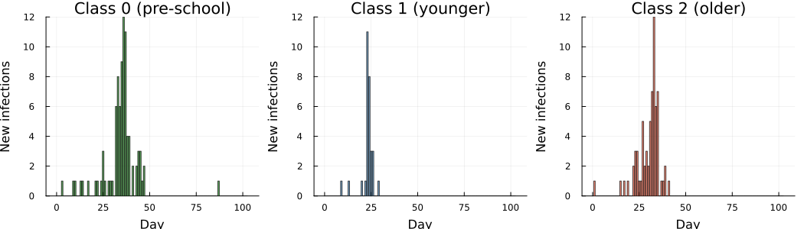
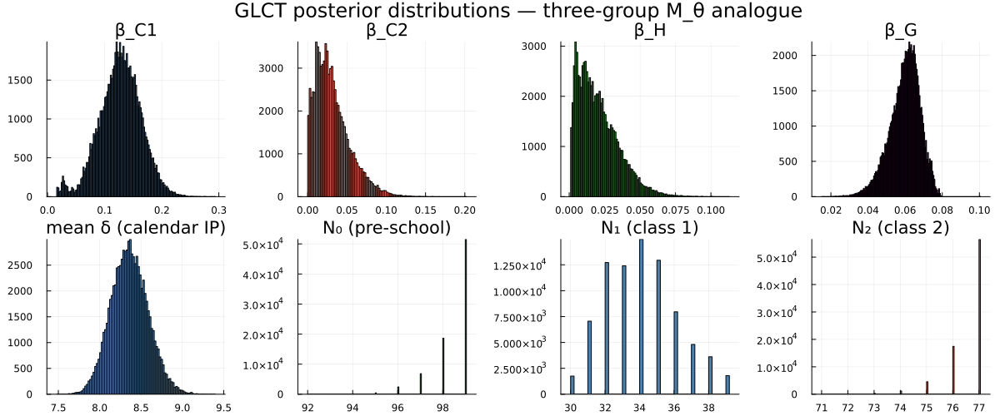
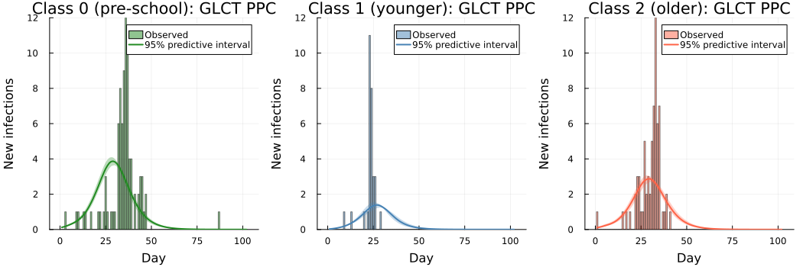
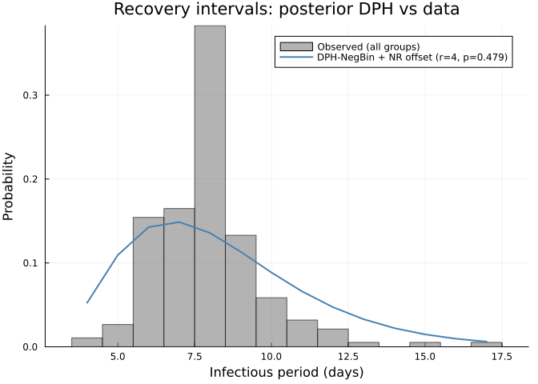

# Hagelloch 1861 measles: GLCT vs Boxcar DDSA comparison (M_θ analogue)
Sandra Montes (`@slmontes`)
2026-03-25

# Introduction

We apply discrete dynamic survival analysis (DDSA) to the 1861 measles
outbreak in Hagelloch, Germany (188 cases over 86 days). The line list
of this outbreak was used on an individual-level analysis by Neal &
Roberts (2004, hereafter NR), which we use as a reference point.

This study treats the Hagelloch measles outbreak as a stress test of our
stratified mean-field DDSA model. The Hagelloch data are a challenging
case because transmission is strongly shaped by individual-level contact
structure (household and classroom links), which is explicitly
represented in the Neal and Roberts framework. By contrast, our
specification intentionally aggregates transmission into three
interacting groups and therefore does not attempt to reproduce the full
contact network.

Our goal is not to reproduce NR’s individual-level household/contact
likelihood, but to assess what a mean-field DDSA analogue can recover
from the case line list with a simplified model: the qualitative
hierarchy of transmission parameters (specifically
$\beta_{C1} > \beta_{C2}$ and $\beta_H > 0$, together with correct
epidemic sequencing of the three groups) and the susceptible group
sizes, which NR treat as fixed but DDSA infers via final-size
constraints. Because the contact structure is aggregated into mean-field
terms, we expect per-group attack rates to be underestimated relative to
the data.

The dataset is available in R’s `outbreaks` package as
`measles_hagelloch_1861`. Individual prodrome-onset dates and rash-onset
dates are recorded for all cases, allowing us to:

1.  Construct the infection-time histogram (`th`) from prodrome-onset
    dates.
2.  Compute observed infectious-period durations (`delta`) as
    $\delta_i = (t_{\mathrm{ERU},i} - t_{\mathrm{PRO},i}) + 4$ days,
    following Neal & Roberts (2004) with $d_0 = 3$ (child remains
    infectious 3 days after rash onset) and $d_1 = 1$ (child becomes
    infectious 1 day before prodrome onset), so the +4 = $d_0 + d_1$.

The infectious period has empirical mean $\approx$ 8 days. We model it
with a NegBin discrete phase-type (DPH) distribution (rather than a
simple geometric period).

Neal & Roberts (2004) partitions the 188 cases into three groups based
on school enrolment:

- *Class 0 (not yet enrolled)*: No initial cases; infected via household
  transmission, peaked later (infection times 8–28 days).
- *Class 1 (younger school class)*: No initial cases; concentrated wave
  peaking around days 21–28.
- *Class 2 (older school class)*: Contains index case; infection times
  span the full epidemic window (days 0–40), with the main wave peaking
  around day 28–30.

We use the four transmission parameters from NR’s model $M_\theta$:
within-class 1 ($\beta_{C1}$), within-class 2 ($\beta_{C2}$), a
household-route term from school to pre-school ($\beta_H$), and a global
uniform-mixing term ($\beta_G$). The infectious period is shared across
classes and modelled with a NegBin DPH. Inference uses a Gibbs scheme:
$\beta_{C1}$, $\beta_{C2}$, $\beta_H$, $\beta_G$, and the calendar mean
$\mathbb{E}[\delta]$ are updated jointly by one NUTS step; while the
phase count $r$ and population sizes $N_0$, $N_1$, $N_2$ are updated by
Metropolis–Hastings. We set $p = r/(\mathbb{E}[\delta]-\delta_{\min}+r)$
given $\mathbb{E}[\delta]$ and $r$. Calendar infectious period $\delta$
includes NR’s fixed $+4$ days, so we prepend $(\delta_{\min}-r)$
deterministic day-states to that DPH (with
$\delta_{\min}=\min_i \delta_i = 4$ here), giving support
$\{\delta_{\min},\delta_{\min}+1,\ldots\}$ and
$\mathbb{E}[\delta]=(\delta_{\min}-r)+r/p$.

NR parameterise the per-day rate at which infectious individual $i$
infects susceptible $j$ as

$$\alpha_{ij} = \beta_H \mathbf{1}_{\{\text{same household}\}} + \beta_C^1 \mathbf{1}_{\{L_i = L_j = 1\}} + \beta_C^2 \mathbf{1}_{\{L_i = L_j = 2\}} + \beta_G,$$

where the global term $\beta_G$ replaces the distance-decay
$\beta_G \exp(-\theta\rho(i,j))$ of the full model M by setting
$\theta = 0$. Our mean-field analogue translates this individual-level
rate into group-level forces of infection:

$$\lambda_0 = \bigl(1 - e^{-[\beta_H (I_1 + I_2) + \beta_G (I_0 + I_1 + I_2)]}\bigr)S_0$$

$$\lambda_1 = \bigl(1 - e^{-[\beta_{C1}\, I_1 + \beta_G (I_0 + I_1 + I_2)]}\bigr)S_1$$

$$\lambda_2 = \bigl(1 - e^{-[\beta_{C2}\, I_2 + \beta_G (I_0 + I_1 + I_2)]}\bigr)S_2$$

Here $S_k$ and $I_k$ are the susceptible and infectious fractions of
group $k$ (each ranging over $[0,1]$), and $N_0$, $N_1$, $N_2$ are
inferred via Binomial final-size likelihoods.

We treat Class 0 as downstream of the school epidemic via the
household-route term $\beta_H$ and allow mixing between the school
classes through $\beta_G$. No spatial coordinates enter the model
($\theta=0$ in the NR notation).

We fit the model using two function-map implementations (GLCT and
Boxcar) that share the same likelihood terms and recovery model. The
agreement between them is used as an implementation check.

## Libraries

``` julia
using Random, LinearAlgebra
import Statistics: mean, std, median, quantile
using Distributions
using Turing
# Compatibility patch for Turing Gibbs/MH warmup copy behavior (needed for some versions of Turing).
let Ti = Turing.Inference
    if isdefined(Ti, :StoreLinkedValues)
        Ty = getfield(Ti, :StoreLinkedValues)
        @eval Base.copy(::$Ty) = $Ty()
    end
    if isdefined(Ti, :StoreUnspecifiedPriors)
        Ty = getfield(Ti, :StoreUnspecifiedPriors)
        @eval Base.copy(x::$Ty) = $Ty(copy(x.vns_with_proposal))
    end
end
using StatsPlots, Plots
using ForwardDiff
using CSV, DataFrames
using MCMCDiagnosticTools

include("./PhaseTypeDistributions.jl")
import .PhaseTypeDistributions
```

``` julia
Random.seed!(1234)
```

# Data

``` julia
df = CSV.read("../hagelloch.csv", DataFrame)

# CSV.jl return type IDs / class labels as Int
function _line_list_id(v)
    ismissing(v) && return nothing
    if v isa Union{Integer, AbstractFloat}
        x = Float64(v)
        isfinite(x) || return nothing
        return Int(round(x))
    end
    s = strip(string(v))
    (isempty(s) || uppercase(s) in ("NA", "N/A", ".")) && return nothing
    return tryparse(Int, s)
end

df0 = filter(r -> coalesce(_line_list_id(r.class), -1) == 0, df)
df1 = filter(r -> coalesce(_line_list_id(r.class), -1) == 1, df)
df2 = filter(r -> coalesce(_line_list_id(r.class), -1) == 2, df)

K0 = nrow(df0)
K1 = nrow(df1)
K2 = nrow(df2)

# Census-based bounds from Neal & Roberts (2004): infer N0,N1,N2 from K0,K1,K2 with N_total=197.
N_total = 197
N0_max  = N_total - K1 - K2   # = 197 - 30 - 68 = 99
N1_max  = N_total - K0 - K2   # = 197 - 90 - 68 = 39
N2_max  = N_total - K0 - K1   # = 197 - 90 - 30 = 77

# Shared epidemic window across all three classes
Tmax = maximum(vcat(df0.t_infection, df1.t_infection, df2.t_infection))

# Shared recovery intervals (all three groups)
delta = vcat(df0.inf_period, df1.inf_period, df2.inf_period)

# Buffer beyond Tmax: a couple of mean infectious periods
nsteps = Tmax + 2 * round(Int, mean(delta))

# Infection-time histograms (1-indexed)
th0 = zeros(Int, nsteps)
th1 = zeros(Int, nsteps)
th2 = zeros(Int, nsteps)
for row in eachrow(df0); idx = row.t_infection + 1; idx <= nsteps && (th0[idx] += 1); end
for row in eachrow(df1); idx = row.t_infection + 1; idx <= nsteps && (th1[idx] += 1); end
for row in eachrow(df2); idx = row.t_infection + 1; idx <= nsteps && (th2[idx] += 1); end

# Support condition for offset NegBin DPH: r ≤ δ_min.
nb_r_max = minimum(delta)
```

    K0=90 (class 0),  K1=30 (class 1),  K2=68 (class 2)
    nsteps = 102  (covers epidemic window to day 86 + buffer)
    Recovery intervals: mean=7.95 d,  min=4,  max=17,  CV=0.219
    nb_r_max = 4  (geometric CV would be 1.0; empirical CV=0.22 → NegBin DPH warranted)

``` julia
# Data-derived: source of infection for class 0 (pre-school) cases
class_lookup = Dict{Int, Int}()
for row in eachrow(df)
    kid = _line_list_id(row.case_ID)
    kid === nothing && continue
    cid = _line_list_id(row.class)
    cid === nothing && continue
    class_lookup[kid] = cid
end
c0_from_school = count(eachrow(df0)) do row
    inf = row.infector
    iid = _line_list_id(inf)
    iid === nothing && return false
    cls = get(class_lookup, iid, nothing)
    cls !== nothing && cls in (1, 2)
end
c0_from_c0 = count(eachrow(df0)) do row
    inf = row.infector
    iid = _line_list_id(inf)
    iid === nothing && return false
    cls = get(class_lookup, iid, nothing)
    cls !== nothing && cls == 0
end
c0_unresolved = K0 - c0_from_school - c0_from_c0
```

    Class 0 infection source (from `infector` column):
      from school siblings (class 1 or 2): 53 / 90  (58.9%)
      from class 0 (community play):        34 / 90  (37.8%)
      unresolved (missing or unknown infector): 3 / 90  (3.3%)

Plot of the infection-time histograms extracted from the data:



# Models

Both the GLCT and Boxcar maps implement the same three-group $M_\theta$
force-of-infection structure and the same NegBin DPH infectious-period
distribution. They differ only in how the infectious-period distribution
is propagated in time: the GLCT updates a phase-vector by matrix
multiplication, while the Boxcar tracks infection-age cohorts using a
discrete hazard vector derived from that same DPH.

## GLCT

The SIR map tracks susceptible fractions $S_k$ and phase-vector
$\mathbf{x}_k$ for each group $k \in \{0, 1, 2\}$. Transmission follows
the forces of infection $\lambda_k$ previously defined, and there is no
feedback from class 0 to school classes.

``` julia
"""GLCT model (M_θ analogue).
Propagates three phase-vectors using the exponential rate-to-probability force of infection"""
function run_sir_mtheta(T_mat, alpha, beta_C1, beta_C2, beta_H, beta_G,
                         rho0, rho1, rho2, nsteps)
    T_el = promote_type(eltype(T_mat), eltype(alpha),
                        typeof(beta_C1), typeof(beta_C2),
                        typeof(beta_H),  typeof(beta_G),
                        typeof(rho0), typeof(rho1), typeof(rho2))

    S0 = one(T_el) - T_el(rho0);  x0 = T_el.(alpha) .* T_el(rho0)
    S1 = one(T_el) - T_el(rho1);  x1 = T_el.(alpha) .* T_el(rho1)
    S2 = one(T_el) - T_el(rho2);  x2 = T_el.(alpha) .* T_el(rho2)

    S0_hist = T_el[S0]
    S1_hist = T_el[S1]
    S2_hist = T_el[S2]

    for _ in 1:nsteps
        I0 = sum(x0);  I1 = sum(x1);  I2 = sum(x2)
        I_total = I0 + I1 + I2

        # Forces of infection (M_θ) 
        # p = 1 − exp(−rate·Δt) with Δt=1; clamp to [0, Sk] for numerical safety
        r0 = T_el(beta_H) * (I1 + I2) + T_el(beta_G) * I_total
        r1 = T_el(beta_C1) * I1        + T_el(beta_G) * I_total
        r2 = T_el(beta_C2) * I2        + T_el(beta_G) * I_total
        λ0 = min(max((one(T_el) - exp(-r0)) * S0, zero(T_el)), S0)
        λ1 = min(max((one(T_el) - exp(-r1)) * S1, zero(T_el)), S1)
        λ2 = min(max((one(T_el) - exp(-r2)) * S2, zero(T_el)), S2)

        x0 = T_mat' * x0 .+ T_el.(alpha) .* λ0
        x1 = T_mat' * x1 .+ T_el.(alpha) .* λ1
        x2 = T_mat' * x2 .+ T_el.(alpha) .* λ2
        S0 -= λ0;  S1 -= λ1;  S2 -= λ2

        push!(S0_hist, S0)
        push!(S1_hist, S1)
        push!(S2_hist, S2)
    end

    function to_pmf(S_hist)
        f = T_el[max(S_hist[t] - S_hist[t+1], zero(T_el)) for t in 1:nsteps]
        sF = sum(f)
        sF > T_el(1e-12) ? f ./ sF : fill(one(T_el)/nsteps, nsteps)
    end

    tau0 = S0_hist[1] - S0_hist[end]
    tau1 = S1_hist[1] - S1_hist[end]
    tau2 = S2_hist[1] - S2_hist[end]

    return (tau0=tau0, f0=to_pmf(S0_hist),
            tau1=tau1, f1=to_pmf(S1_hist),
            tau2=tau2, f2=to_pmf(S2_hist))
end
```

## Boxcar

The Boxcar model uses infection-age cohort bookkeeping: newly infected
individuals enter age class 1 and advance one step per day, exiting at
the discrete hazard $h(k) = P(W=k \mid W \geq k)$ derived from the same
offset NegBin DPH. Both representations share the same marginal
recovery-time distribution and the same $1 - e^{-\text{rate}}$
discretisation of the force of infection.

The hazard vector $\mathbf{h}$ is computed by iterating the
transient-state vector $\mathbf{x}_{k+1} = S^\top\mathbf{x}_k$ (starting
from $\mathbf{x}_1 = \alpha$) and setting
$h(k) = (\mathbf{x}_k \cdot \mathbf{s})/\sum\mathbf{x}_k$, where
$\mathbf{s}$ is the absorption probability vector. The implementation is
ForwardDiff-compatible (Dual-valued parameters), other AD methods may
also work but have not been tested here.

``` julia
"""Compute discrete hazard h[k] = P(W=k|W≥k) from a DPH by iterating the state vector.
If dph has ForwardDiff Dual parameters, returns a Dual-typed vector."""
function hazard_vector_from_dph(dph, K_age::Integer)
    T   = eltype(dph.α)
    s   = dph.s
    h   = Vector{T}(undef, K_age)
    x   = copy(dph.α)          # state probability vector at infection-age 1
    for k in 1:K_age
        sf_val  = sum(x)
        pmf_val = dot(x, s)
        h[k]    = (sf_val > T(1e-15) && isfinite(sf_val)) ? pmf_val / sf_val : T(0.01)
        x       = dph.S' * x   # advance to next infection age
    end
    h[end] = one(T)            # boundary: everyone at the last class recovers
    return clamp.(h, zero(T), one(T))
end

"""Three-group SIR Boxcar map (M_θ analogue).
Propagates three infection-age vectors using discrete hazard h_rec and the same exponential rate-to-probability force."""
function run_sir_mtheta_boxcar(h_rec, K_age::Int,
                                beta_C1, beta_C2, beta_H, beta_G,
                                rho0, rho1, rho2, nsteps::Int)
    T_el = promote_type(eltype(h_rec), typeof(beta_C1), typeof(beta_C2),
                        typeof(beta_H),  typeof(beta_G),
                        typeof(rho0), typeof(rho1), typeof(rho2))

    S0 = one(T_el) - T_el(rho0)
    S1 = one(T_el) - T_el(rho1)
    S2 = one(T_el) - T_el(rho2)

    # All initial infecteds placed in age class 1 (consistent with offset DPH α[1]=1)
    x0 = zeros(T_el, K_age);  x0[1] = T_el(rho0)
    x1 = zeros(T_el, K_age);  x1[1] = T_el(rho1)
    x2 = zeros(T_el, K_age);  x2[1] = T_el(rho2)

    S0_hist = T_el[S0];  S1_hist = T_el[S1];  S2_hist = T_el[S2]

    for _ in 1:nsteps
        I0 = sum(x0);  I1 = sum(x1);  I2 = sum(x2)
        I_total = I0 + I1 + I2

        # Exponential rate-to-probability discretisation — identical to run_sir_mtheta
        r0 = T_el(beta_H) * (I1 + I2) + T_el(beta_G) * I_total
        r1 = T_el(beta_C1) * I1        + T_el(beta_G) * I_total
        r2 = T_el(beta_C2) * I2        + T_el(beta_G) * I_total
        λ0 = min(max((one(T_el) - exp(-r0)) * S0, zero(T_el)), S0)
        λ1 = min(max((one(T_el) - exp(-r1)) * S1, zero(T_el)), S1)
        λ2 = min(max((one(T_el) - exp(-r2)) * S2, zero(T_el)), S2)

        x0_new = zeros(T_el, K_age)
        x1_new = zeros(T_el, K_age)
        x2_new = zeros(T_el, K_age)

        # New infections enter age class 1
        x0_new[1] += λ0;  x1_new[1] += λ1;  x2_new[1] += λ2

        # Advance age classes; h[k] fraction absorbs (recovers), 1−h[k] advances
        @inbounds for k in 1:(K_age - 1)
            h_k = T_el(h_rec[k])
            x0_new[k+1] += x0[k] * (one(T_el) - h_k)
            x1_new[k+1] += x1[k] * (one(T_el) - h_k)
            x2_new[k+1] += x2[k] * (one(T_el) - h_k)
        end
        # k == K_age: h[K_age]=1, all remaining mass is absorbed

        x0 = x0_new;  x1 = x1_new;  x2 = x2_new
        S0 = max(zero(T_el), S0 - λ0)
        S1 = max(zero(T_el), S1 - λ1)
        S2 = max(zero(T_el), S2 - λ2)

        push!(S0_hist, S0);  push!(S1_hist, S1);  push!(S2_hist, S2)
    end

    function to_pmf(S_hist)
        f = T_el[max(S_hist[t] - S_hist[t+1], zero(T_el)) for t in 1:nsteps]
        sF = sum(f)
        sF > T_el(1e-12) ? f ./ sF : fill(one(T_el)/nsteps, nsteps)
    end

    tau0 = S0_hist[1] - S0_hist[end]
    tau1 = S1_hist[1] - S1_hist[end]
    tau2 = S2_hist[1] - S2_hist[end]

    return (tau0=tau0, f0=to_pmf(S0_hist),
            tau1=tau1, f1=to_pmf(S1_hist),
            tau2=tau2, f2=to_pmf(S2_hist))
end
```

    K_age_boxcar = 40  (99.99th-percentile truncation for Boxcar age dimension)

# Inference

Inference uses a Gibbs scheme: $\beta_{C1}$, $\beta_{C2}$, $\beta_H$,
$\beta_G$, $\mathbb{E}[\delta]$ are updated jointly by one NUTS step,
while the four discrete parameters (nb_r, $N_0$, $N_1$, $N_2$) are
sampled by Metropolis–Hastings (NegBin–DPH with Neal–Roberts offset).
The epidemic is seeded by a single index case in Class 2
($\rho_2 = 1/N_2$) with no initial infections in Classes 0 or 1
($\rho_0 = \rho_1 = 0$), consistent with the Hagelloch data where the
first recorded case belongs to Class 2.

The group population sizes are not recoverable from `hagelloch.csv`,
which records only the 188 infected individuals. All three susceptible
population sizes are therefore inferred from the data via the Binomial
final-size constraints $K_k \sim \mathrm{Binomial}(N_k, \tau_k)$ for
$k \in \{0, 1, 2\}$. By contrast, in the Hagelloch analysis of Neal &
Roberts (2004), population size is treated as given (they assume
$m=n=188$) within an individual event-history likelihood. Thus, their
framework does not identify group denominators from aggregate case
counts alone.

Each $N_k$ is given a $\mathrm{DiscreteUniform}(K_k, N_{k,\max})$ prior.
The lower bound $K_k$ is the minimum possible group size (cannot have
fewer susceptibles than observed cases). For the upper bound we use an
external population count: Pfeilsticker’s original epidemic
documentation (as cited in Neal & Roberts, 2004) records 197 children
under 14 in Hagelloch at the time of the outbreak. Of these, 185 were
infected and are present in the line list (plus 3 teenagers aged 14–15,
giving $K = 188$ total); the 12 non-infected children each had a
documented reason for non-infection (7 infants with placental immunity,
3 kept in total isolation, 1 two-year-old, 1 immigrant who had
previously had measles). Neal & Roberts therefore conclude that
virtually all truly susceptible children were infected, and treat the
total susceptible population as $N_{\mathrm{total}} = 197$.

Assuming all 197 children belong to one of the three groups, the maximum
possible size of group $k$ is:

$$N_{k,\max} = N_{\mathrm{total}} - K_{k'} - K_{k''}.$$

This gives $N_0 \in [90, 99]$, $N_1 \in [30, 39]$, $N_2 \in [68, 77]$,
tight ranges reflecting the near-complete attack rate (188/197 = 95%).

## GLCT Turing model

``` julia
function safe_normalise(f::AbstractVector{T}, n::Int) where T
    f_pos = ifelse.(isnan.(f) .| .!isfinite.(f), zero(T), max.(f, zero(T)))
    sF = sum(f_pos)
    (sF > T(1e-15) && isfinite(sF)) ? f_pos ./ sF : fill(one(T)/n, n)
end

# Infectious period: offset NegBin DPH with minimum δ_floor.

@model function ddsa_hagelloch_mtheta(K0::Int, K1::Int, K2::Int,
                                       N0_max::Int, N1_max::Int, N2_max::Int,
                                       th0::Vector{Int}, th1::Vector{Int},
                                       th2::Vector{Int},
                                       delta::Vector{Int},
                                       nsteps::Int,
                                       δ_floor::Int)
    # Priors — population sizes inferred within census-derived bounds
    N0 ~ DiscreteUniform(K0, N0_max)
    N1 ~ DiscreteUniform(K1, N1_max)
    N2 ~ DiscreteUniform(K2, N2_max)

    # Index case in class 2; rho2 seeds one case out of N2 susceptibles
    rho0 = 0.0
    rho1 = 0.0
    rho2 = 1.0 / N2

    # Exponential priors to avoid near-zero-rate initialisation.
    beta_C1 ~ Exponential(0.2)
    beta_C2 ~ Exponential(0.1)
    beta_H  ~ Exponential(0.1)
    beta_G  ~ Exponential(0.1)
    # Reparameterise (r, p) by mean δ for better Gibbs/NUTS geometry.
    mean_δ ~ Uniform(δ_floor + 0.5, 25.0)
    nb_r ~ DiscreteUniform(1, nb_r_max)
    nb_p = nb_r / (mean_δ - δ_floor + nb_r)

    dph = PhaseTypeDistributions.dph_negative_binomial_min_support(nb_r, nb_p, δ_floor)

    sim = run_sir_mtheta(dph.S, dph.α, beta_C1, beta_C2, beta_H, beta_G,
                          rho0, rho1, rho2, nsteps)

    tau0 = clamp(sim.tau0, 0.001, 0.999)
    tau1 = clamp(sim.tau1, 0.001, 0.999)
    tau2 = clamp(sim.tau2, 0.001, 0.999)

    f0 = safe_normalise(sim.f0, nsteps)
    f1 = safe_normalise(sim.f1, nsteps)
    f2 = safe_normalise(sim.f2, nsteps)

    # Binomial final-size constraints for all three groups
    K0 ~ Binomial(N0, tau0)
    K1 ~ Binomial(N1, tau1)
    K2 ~ Binomial(N2, tau2)

    # Infection-time histograms
    if K0 > 0 && all(isfinite, f0) && abs(sum(f0) - 1) < 0.01
        th0 ~ Multinomial(K0, f0)
    else
        Turing.@addlogprob! -Inf
    end
    if K1 > 0 && all(isfinite, f1) && abs(sum(f1) - 1) < 0.01
        th1 ~ Multinomial(K1, f1)
    else
        Turing.@addlogprob! -Inf
    end
    if K2 > 0 && all(isfinite, f2) && abs(sum(f2) - 1) < 0.01
        th2 ~ Multinomial(K2, f2)
    else
        Turing.@addlogprob! -Inf
    end

    # Shared NegBin DPH recovery likelihood
    n_δ = length(delta)
    for i in 1:n_δ
        delta[i] ~ dph
    end
end
```

## Boxcar Turing model

``` julia
@model function ddsa_hagelloch_mtheta_boxcar(K0::Int, K1::Int, K2::Int,
                                              N0_max::Int, N1_max::Int, N2_max::Int,
                                              th0::Vector{Int}, th1::Vector{Int},
                                              th2::Vector{Int},
                                              delta::Vector{Int},
                                              nsteps::Int,
                                              δ_floor::Int,
                                              K_age::Int)
    N0 ~ DiscreteUniform(K0, N0_max)
    N1 ~ DiscreteUniform(K1, N1_max)
    N2 ~ DiscreteUniform(K2, N2_max)

    rho0 = 0.0;  rho1 = 0.0;  rho2 = 1.0 / N2

    beta_C1 ~ Exponential(0.2)
    beta_C2 ~ Exponential(0.1)
    beta_H  ~ Exponential(0.1)
    beta_G  ~ Exponential(0.1)
    mean_δ  ~ Uniform(δ_floor + 0.5, 25.0)
    nb_r    ~ DiscreteUniform(1, nb_r_max)
    nb_p    = nb_r / (mean_δ - δ_floor + nb_r)

    dph   = PhaseTypeDistributions.dph_negative_binomial_min_support(nb_r, nb_p, δ_floor)
    h_rec = hazard_vector_from_dph(dph, K_age)

    sim  = run_sir_mtheta_boxcar(h_rec, K_age, beta_C1, beta_C2, beta_H, beta_G,
                                  rho0, rho1, rho2, nsteps)

    tau0 = clamp(sim.tau0, 0.001, 0.999)
    tau1 = clamp(sim.tau1, 0.001, 0.999)
    tau2 = clamp(sim.tau2, 0.001, 0.999)

    f0 = safe_normalise(sim.f0, nsteps)
    f1 = safe_normalise(sim.f1, nsteps)
    f2 = safe_normalise(sim.f2, nsteps)

    K0 ~ Binomial(N0, tau0)
    K1 ~ Binomial(N1, tau1)
    K2 ~ Binomial(N2, tau2)

    if K0 > 0 && all(isfinite, f0) && abs(sum(f0) - 1) < 0.01
        th0 ~ Multinomial(K0, f0)
    else
        Turing.@addlogprob! -Inf
    end
    if K1 > 0 && all(isfinite, f1) && abs(sum(f1) - 1) < 0.01
        th1 ~ Multinomial(K1, f1)
    else
        Turing.@addlogprob! -Inf
    end
    if K2 > 0 && all(isfinite, f2) && abs(sum(f2) - 1) < 0.01
        th2 ~ Multinomial(K2, f2)
    else
        Turing.@addlogprob! -Inf
    end

    # Recovery likelihood: same offset DPH PMF 
    n_δ = length(delta)
    for i in 1:n_δ
        delta[i] ~ dph
    end
end
```

## Sampler

Both models use an identical sampler configuration: independence
Metropolis–Hastings for `nb_r`, one joint Metropolis–Hastings block for
($N_0$, $N_1$, $N_2$), and one joint NUTS step for the five continuous
parameters ($\beta_{C1}$, $\beta_{C2}$, $\beta_H$, $\beta_G$, `mean_δ`)
each full Gibbs sweep. Four parallel chains are run with cold starts
(initial `nb_r` spread over $\{1,\ldots,4\}$; moderate $\beta$’s and
`mean_δ`).

**GLCT**

``` julia
n_samples  = 20_000
nuts_adapt = 2_000
n_chains   = 4

gibbs_sampler   = Gibbs(
    :nb_r    => MH(:nb_r => DiscreteUniform(1, nb_r_max)),
    (:N0, :N1, :N2) =>
        MH(:N0 => DiscreteUniform(K0, N0_max),
           :N1 => DiscreteUniform(K1, N1_max),
           :N2 => DiscreteUniform(K2, N2_max)),
    (:beta_C1, :beta_C2, :beta_H, :beta_G, :mean_δ) => NUTS(nuts_adapt, 0.8; max_depth=12, Δ_max=1000.0)
)

delta_bar = mean(delta)
# Spread initial β_C2 across chains so cold starts are less likely to lock all chains in the same ridge.
init_params_vec = [
    (nb_r = i,
     mean_δ = delta_bar,
     N0 = K0 + 5, N1 = K1 + 5, N2 = K2 + 5,
     beta_C1 = 0.2, beta_C2 = 0.05 + 0.05 * (i - 1), beta_H = 0.1, beta_G = 0.1)
    for i in 1:n_chains
]
```

``` julia
δ_floor_ip = minimum(delta)
model_mtheta = ddsa_hagelloch_mtheta(K0, K1, K2, N0_max, N1_max, N2_max,
                                      th0, th1, th2, delta, nsteps, δ_floor_ip)

# Warm-up sample to trigger JIT
_ = sample(model_mtheta, gibbs_sampler, 1;
           progress=false, initial_params=init_params_vec[1])

chain = sample(model_mtheta, gibbs_sampler, MCMCThreads(), n_samples, n_chains;
               progress=false, initial_params=init_params_vec)
```

    Chains MCMC chain (20000×12×4 Array{Float64, 3}):

    Iterations        = 1:1:20000
    Number of chains  = 4
    Samples per chain = 20000
    Wall duration     = 114.31 seconds
    Compute duration  = 439.97 seconds
    parameters        = N0, N1, N2, beta_C1, beta_C2, beta_H, beta_G, mean_δ, nb_r
    internals         = logprior, loglikelihood, logjoint

    Summary Statistics

      parameters      mean       std      mcse    ess_bulk     ess_tail      rhat  ⋯
          Symbol   Float64   Float64   Float64     Float64      Float64   Float64  ⋯

              N0   98.4736    0.8422    0.0239   1086.4295          NaN    1.0035  ⋯
              N1   34.0093    2.0787    0.0682    935.1152     991.6362    1.0042  ⋯
              N2   76.6068    0.7031    0.0192   1221.6998          NaN    1.0010  ⋯
         beta_C1    0.1273    0.0362    0.0020    337.5476     264.6465    1.0187  ⋯
         beta_C2    0.0315    0.0220    0.0013    223.6748     194.5032    1.0588  ⋯
          beta_H    0.0206    0.0142    0.0008    229.6769     231.4739    1.0920  ⋯
          beta_G    0.0598    0.0083    0.0005    248.8292     275.1339    1.0519  ⋯
          mean_δ    8.3618    0.2241    0.0030   5425.2417   11702.9635    1.0004  ⋯
            nb_r    3.9993    0.0302    0.0003   7470.9684          NaN    1.0003  ⋯

                                                                    1 column omitted

    Quantiles

      parameters      2.5%     25.0%     50.0%     75.0%     97.5% 
          Symbol   Float64   Float64   Float64   Float64   Float64 

              N0   96.0000   98.0000   99.0000   99.0000   99.0000
              N1   31.0000   32.0000   34.0000   35.0000   38.0000
              N2   75.0000   76.0000   77.0000   77.0000   77.0000
         beta_C1    0.0506    0.1045    0.1282    0.1516    0.1956
         beta_C2    0.0021    0.0147    0.0271    0.0433    0.0856
          beta_H    0.0023    0.0095    0.0178    0.0291    0.0543
          beta_G    0.0413    0.0549    0.0607    0.0655    0.0740
          mean_δ    7.9386    8.2074    8.3572    8.5112    8.8144
            nb_r    4.0000    4.0000    4.0000    4.0000    4.0000

**Boxcar**

``` julia
gibbs_boxcar = Gibbs(
    :nb_r    => MH(:nb_r => DiscreteUniform(1, nb_r_max)),
    (:N0, :N1, :N2) =>
        MH(:N0 => DiscreteUniform(K0, N0_max),
           :N1 => DiscreteUniform(K1, N1_max),
           :N2 => DiscreteUniform(K2, N2_max)),
    (:beta_C1, :beta_C2, :beta_H, :beta_G, :mean_δ) =>
        NUTS(nuts_adapt, 0.8; max_depth=12, Δ_max=1000.0)
)

init_params_bc = [
    (nb_r = i,
     mean_δ = delta_bar,
     N0 = K0 + 5, N1 = K1 + 5, N2 = K2 + 5,
     beta_C1 = 0.2, beta_C2 = 0.05 + 0.05 * (i - 1), beta_H = 0.1, beta_G = 0.1)
    for i in 1:n_chains
]
```

``` julia
model_boxcar = ddsa_hagelloch_mtheta_boxcar(K0, K1, K2, N0_max, N1_max, N2_max,
                                             th0, th1, th2, delta, nsteps,
                                             δ_floor_ip, K_age_boxcar)

_ = sample(model_boxcar, gibbs_boxcar, 1;
           progress=false, initial_params=init_params_bc[1])

chain_bc = sample(model_boxcar, gibbs_boxcar, MCMCThreads(), n_samples, n_chains;
                  progress=false, initial_params=init_params_bc)
```

    Chains MCMC chain (20000×12×4 Array{Float64, 3}):

    Iterations        = 1:1:20000
    Number of chains  = 4
    Samples per chain = 20000
    Wall duration     = 140.78 seconds
    Compute duration  = 518.58 seconds
    parameters        = N0, N1, N2, beta_C1, beta_C2, beta_H, beta_G, mean_δ, nb_r
    internals         = logprior, loglikelihood, logjoint

    Summary Statistics

      parameters      mean       std      mcse     ess_bulk     ess_tail      rhat ⋯
          Symbol   Float64   Float64   Float64      Float64      Float64   Float64 ⋯

              N0   98.3954    0.8939    0.0214    1495.5551          NaN    1.0033 ⋯
              N1   34.0935    2.1558    0.0634    1218.8205    1604.2959    1.0054 ⋯
              N2   76.5513    0.7646    0.0184    1478.8069          NaN    1.0014 ⋯
         beta_C1    0.1244    0.0335    0.0017     383.2430     449.3048    1.0243 ⋯
         beta_C2    0.0293    0.0233    0.0015     204.0762     191.6891    1.0915 ⋯
          beta_H    0.0209    0.0128    0.0007     242.4354     289.1144    1.0600 ⋯
          beta_G    0.0603    0.0078    0.0005     253.8788     433.8472    1.0587 ⋯
          mean_δ    8.3541    0.2248    0.0029    5844.4537   11809.4201    1.0002 ⋯
            nb_r    3.9996    0.0255    0.0002   16027.3532          NaN    1.0002 ⋯

                                                                    1 column omitted

    Quantiles

      parameters      2.5%     25.0%     50.0%     75.0%     97.5% 
          Symbol   Float64   Float64   Float64   Float64   Float64 

              N0   96.0000   98.0000   99.0000   99.0000   99.0000
              N1   31.0000   32.0000   34.0000   36.0000   39.0000
              N2   74.0000   76.0000   77.0000   77.0000   77.0000
         beta_C1    0.0611    0.1009    0.1235    0.1468    0.1928
         beta_C2    0.0007    0.0093    0.0255    0.0437    0.0837
          beta_H    0.0044    0.0113    0.0180    0.0275    0.0522
          beta_G    0.0419    0.0561    0.0614    0.0658    0.0726
          mean_δ    7.9348    8.1991    8.3471    8.5027    8.8138
            nb_r    4.0000    4.0000    4.0000    4.0000    4.0000

# Results

## Convergence

**GLCT**

    ESS and R̂:

    ESS/R-hat

      parameters         ess      rhat   ess_per_sec 
          Symbol     Float64   Float64       Float64 

              N0   1086.4295    1.0035        2.4693
              N1    935.1152    1.0042        2.1254
              N2   1221.6998    1.0010        2.7768
         beta_C1    337.5476    1.0187        0.7672
         beta_C2    223.6748    1.0588        0.5084
          beta_H    229.6769    1.0920        0.5220
          beta_G    248.8292    1.0519        0.5656
          mean_δ   5425.2417    1.0004       12.3309
            nb_r   7470.9684    1.0003       16.9805

**Boxcar**

    Boxcar — ESS and R̂:

    ESS/R-hat

      parameters          ess      rhat   ess_per_sec 
          Symbol      Float64   Float64       Float64 

              N0    1495.5551    1.0033        2.8839
              N1    1218.8205    1.0054        2.3503
              N2    1478.8069    1.0014        2.8516
         beta_C1     383.2430    1.0243        0.7390
         beta_C2     204.0762    1.0915        0.3935
          beta_H     242.4354    1.0600        0.4675
          beta_G     253.8788    1.0587        0.4896
          mean_δ    5844.4537    1.0002       11.2701
            nb_r   16027.3532    1.0002       30.9062

## Posterior summaries

GLCT posterior means:

    β_C1  = 0.1273  (within-class 1)
    β_C2  = 0.0315  (within-class 2)
    β_H   = 0.0206  (household: school → class 0)
    β_G   = 0.0598  (global uniform mixing)
    nb_r  = 4,  nb_p = 0.479 (derived),  mean δ = 8.36 d  (joint NUTS on β's + mean_δ; δ_floor=4),  CV = 0.361
    N0 = 98 (K0=90, observed K0/N0 at posterior-mean N0 = 0.918)  prior: [90, 99]
    N1 = 34 (K1=30, observed K1/N1 at posterior-mean N1 = 0.882)  prior: [30, 39]
    N2 = 77 (K2=68, observed K2/N2 at posterior-mean N2 = 0.883)  prior: [68, 77]

    Comparison with Neal and Roberts M_θ structure:
      β_C1/β_C2 ratio = 4.04  (expect > 1: younger class has higher within-class rate)
      β_H/β_G ratio   = 0.34  (mean-field β_H diluted over all class-0 × school pairs; expect < 1 vs NR individual-level)

GLCT 95% credible intervals:

      beta_C1   : (0.0506, 0.1956)
      beta_C2   : (0.0021, 0.0856)
      beta_H    : (0.0023, 0.0543)
      beta_G    : (0.0413, 0.074)
      mean_δ    : (7.9386, 8.8144)
      nb_p       (derived): (0.4537, 0.5039)
      nb_r      : (4, 4)
      N0        : (96, 99)
      N1        : (31, 38)
      N2        : (75, 77)

Boxcar posterior means:

    β_C1  = 0.1244
    β_C2  = 0.0293
    β_H   = 0.0209
    β_G   = 0.0603
    nb_r  = 4,  nb_p = 0.479,  mean δ = 8.35 d
    N0 = 98  (K0=90, observed K0/N0 at posterior-mean N0 = 0.918)
    N1 = 34  (K1=30, observed K1/N1 at posterior-mean N1 = 0.882)
    N2 = 77  (K2=68, observed K2/N2 at posterior-mean N2 = 0.883)

The table below displays the posterior means for all parameters, and
both GLCT and Boxcar maps should recover essentially the same parameter
values.

    Parameter     GLCT          Boxcar
    ------------------------------------------
    β_C1          0.1273        0.1244
    β_C2          0.0315        0.0293
    β_H           0.0206        0.0209
    β_G           0.0598        0.0603
    mean δ        8.3618        8.3541
    nb_p          0.4787        0.4791
    N0            98.0          98.0
    N1            34.0          34.0
    N2            77.0          77.0

<div id="fig-posteriors">



Figure 1

</div>

## R0

The basic reproduction number for the three-group model is the dominant
eigenvalue of the next-generation matrix $K$, where entry $K_{ij}$ gives
the expected number of secondary infections in group $i$ caused by a
single infectious individual in group $j$, introduced into a fully
susceptible population.

From the M_θ force-of-infection equations the NGM is:

$$K = \mathrm{mean\_ip} \times \begin{pmatrix} \frac{N_0}{N_0}\beta_G & \frac{N_0}{N_1}(\beta_H+\beta_G) & \frac{N_0}{N_2}(\beta_H+\beta_G) \\ \frac{N_1}{N_0}\beta_G & \frac{N_1}{N_1}(\beta_{C1}+\beta_G) & \frac{N_1}{N_2}\beta_G \\ \frac{N_2}{N_0}\beta_G & \frac{N_2}{N_1}\beta_G & \frac{N_2}{N_2}(\beta_{C2}+\beta_G) \end{pmatrix}$$

where entry $K_{ij}$ equals
$(N_i/N_j) \times \beta_{ij} \times \mathrm{mean\_ip}$, with the
$N_i/N_j$ factor arising because the model state variables are per-group
fractions (one infected in group $j$ corresponds to fraction $1/N_j$).

      GLCT:   mean = 2.187  95% CI = (2.024, 2.389)
      Boxcar: mean = 2.179  95% CI = (2.021, 2.377)

## Posterior predictive checks

``` julia
function posterior_predictions_mtheta(chain, n_draws=200)
    n_total = length(vec(chain[:beta_C1]))
    idx = round.(Int, range(1, n_total, length=n_draws))
    τ0_v = zeros(n_draws)
    τ1_v = zeros(n_draws)
    τ2_v = zeros(n_draws)
    f0_m = zeros(nsteps, n_draws)
    f1_m = zeros(nsteps, n_draws)
    f2_m = zeros(nsteps, n_draws)
    for (k, i) in enumerate(idx)
        bC1 = vec(chain[:beta_C1])[i]
        bC2 = vec(chain[:beta_C2])[i]
        bH  = vec(chain[:beta_H])[i]
        bG  = vec(chain[:beta_G])[i]
        nr  = round(Int, vec(chain[:nb_r])[i])
        mδ  = vec(chain[:mean_δ])[i]
        np  = nr / (mδ - δ_floor_ip + nr)
        n2_i  = round(Int, vec(chain[:N2])[i])
        dph_i = PhaseTypeDistributions.dph_negative_binomial_min_support(nr, np, δ_floor_ip)
        sim = run_sir_mtheta(dph_i.S, dph_i.α, bC1, bC2, bH, bG,
                              0.0, 0.0, 1.0/n2_i, nsteps)
        τ0_v[k] = sim.tau0
        τ1_v[k] = sim.tau1
        τ2_v[k] = sim.tau2
        f0_m[:, k] .= sim.f0
        f1_m[:, k] .= sim.f1
        f2_m[:, k] .= sim.f2
    end
    return τ0_v, τ1_v, τ2_v, f0_m, f1_m, f2_m
end

τ0_post, τ1_post, τ2_post, f0_ppc, f1_ppc, f2_ppc =
    posterior_predictions_mtheta(chain)
```

<div id="fig-ppc">



Figure 2

</div>

``` julia
function posterior_predictions_mtheta_boxcar(chain, n_draws=200)
    n_total = length(vec(chain[:beta_C1]))
    idx     = round.(Int, range(1, n_total, length=n_draws))
    τ0_v    = zeros(n_draws);  τ1_v = zeros(n_draws);  τ2_v = zeros(n_draws)
    f0_m    = zeros(nsteps, n_draws)
    f1_m    = zeros(nsteps, n_draws)
    f2_m    = zeros(nsteps, n_draws)
    for (k, i) in enumerate(idx)
        bC1   = vec(chain[:beta_C1])[i];  bC2 = vec(chain[:beta_C2])[i]
        bH    = vec(chain[:beta_H])[i];   bG  = vec(chain[:beta_G])[i]
        nr    = round(Int, vec(chain[:nb_r])[i])
        mδ    = vec(chain[:mean_δ])[i]
        np    = nr / (mδ - δ_floor_ip + nr)
        n2_i  = round(Int, vec(chain[:N2])[i])
        dph_i = PhaseTypeDistributions.dph_negative_binomial_min_support(nr, np, δ_floor_ip)
        h_i   = hazard_vector_from_dph(dph_i, K_age_boxcar)
        sim   = run_sir_mtheta_boxcar(h_i, K_age_boxcar, bC1, bC2, bH, bG,
                                       0.0, 0.0, 1.0/n2_i, nsteps)
        τ0_v[k] = sim.tau0;  τ1_v[k] = sim.tau1;  τ2_v[k] = sim.tau2
        f0_m[:, k] .= sim.f0;  f1_m[:, k] .= sim.f1;  f2_m[:, k] .= sim.f2
    end
    return τ0_v, τ1_v, τ2_v, f0_m, f1_m, f2_m
end

τ0_bc, τ1_bc, τ2_bc, f0_ppc_bc, f1_ppc_bc, f2_ppc_bc =
    posterior_predictions_mtheta_boxcar(chain_bc)
```

<div id="fig-ppc-boxcar">


Figure 3

</div>

## Recovery interval fit

    Empirical mean δ = 7.95 d,  DPH posterior mean δ = 8.36 d

<div id="fig-recovery-ppc">



Figure 4

</div>

# Discussion

We developed a mean-field analogue of Neal & Roberts (2004) with grouped
compartments. Neal & Roberts (2004) explicitly set $n = m = 188$ for
their analysis: the susceptible population size equals the total number
of infected individuals, implying a 100% attack rate across all three
groups. They justify this by noting that 185 of 197 children under 14
were infected, and that the 12 non-infected children were either infants
carrying placental immunity, children kept in total isolation, a
two-year-old who did not attend school, or an immigrant who had
previously had measles.

In our DDSA model, all three susceptible population sizes are inferred
jointly via Binomial final-size constraints, with priors derived from
the number of children under 14: $N_{\mathrm{total}} = 197$ (Neal &
Roberts, 2004). This yields $N_0 \in [90,99]$, $N_1 \in [30,39]$,
$N_2 \in [68,77]$, ranges that are consistent with Neal & Roberts’
n=m=188 assumption (nearly 100% attack rate) while allowing the data to
determine where within those bounds the posterior concentrates.

We note that the $\beta$ parameter values are not directly comparable in
scale: Neal & Roberts use individual-to-individual per-day rates; our
mean-field formulation uses $\beta \times I \times S$. Thus, we present
a qualitative comparison of the parameter structure.

Neal & Roberts’ full model included a spatial distance-decay term; in
the non-spatial comparison considered here, this corresponds to setting
$\theta = 0$ so the global component reduces to uniform mixing. A
separate distinction concerns household transmission. In the NR
individual-level model, $\beta_H$ applies only to genuine household
pairs (a Class 0 child is exposed via $\beta_H$ only to infectious
school-age siblings in the same household). In our mean-field analogue,
the household term enters at the group level and is applied across all
(Class 0) $\times$ (Class 1 + Class 2) pairs. This difference affects
the scale of $\beta_H$: to match an aggregate household contribution,
the mean-field $\beta_H$ is typically smaller (spread over many more
potential pairs), and transmission not attributed to $\beta_H$ is
absorbed by $\beta_G$.

    Population treatment (all three N inferred via Binomial final-size):
      N0 = 98 [90, 99]  →  K0=90/N0=98 = 91.8%
      N1 = 34 [30, 39]  →  K1=30/N1=34 = 88.2%
      N2 = 77 [68, 77]  →  K2=68/N2=77 = 88.3%
      (NR n=m=188 implies 100% attack rate; DDSA infers from data within census bounds)

    Qualitative checks:
      1. β_C1 > β_C2:  true  (NR: evidence for different classroom rates)
      2. β_H > 0:      true  (NR: strong household effect)
      3. β_G > 0:      true  (NR: global mixing component)
      4. P(β_C1>β_C2) = 0.994

The posterior attack rate for Class 1 ($\hat{\tau}_1 \approx K_1/N_1$)
is consistent with DDSA recovering both the transmission dynamics and
final size for internally homogeneous groups. The underprediction of
attack rates for Classes 0 and 2 ($\hat{\tau} \approx 0.74$–$0.77$ vs
observed $\approx 0.88$–$0.92$) is a consequence of the mean-field
approximation applied to groups with heterogeneous internal contact
structure, and the $\beta$ estimates for these groups should be
interpreted accordingly. A wider choice of $N_{\mathrm{total}}$
(i.e. relaxing the census bound of 197 children under 14) would increase
the uncertainty on $N_0$ and $N_2$ but would not qualitatively change
the recovered parameter ordering or the $\beta_{C1} > \beta_{C2}$
finding.

For the infectious period, `dph_negative_binomial_min_support` enforces
$r \leq \delta_{\min}$ when $\delta_{\min}$ is the calendar minimum
(here, 4 days), so $r$ cannot exceed 4 in this construction. The
dwell-time parameters are in any case estimated jointly with
transmission. A hard upper bound on $r$ can make residual marginal
misfit interpretable as a model-class limit rather than as precise
identification of $r$, but the fit is still consistent with the data.

    Class 0:  K=90,  N=98 [96, 99]  observed K/N at posterior-mean N=0.918  model-implied posterior τ=0.772  [0.716, 0.83]
    Class 1:  K=30,  N=34 [31, 38]  observed K/N at posterior-mean N=0.882  model-implied posterior τ=0.882  [0.822, 0.919]
    Class 2:  K=68,  N=77 [75, 77]  observed K/N at posterior-mean N=0.883  model-implied posterior τ=0.742  [0.668, 0.803]

In the observed data, Class 1 infection times cluster around days 21–28
while Class 2’s main wave spans days 26–40, so
`P(Class 1 peaks after Class 2)` near zero. Another check is that
`P(Class 0 peaks after Class 1)` should be close to 1, confirming that
the household-driven pre-school epidemic is correctly identified as a
downstream consequence of the school outbreak.

    Mean peak days:  Class 0=28.9,  Class 1=26.9,  Class 2=29.3
    P(Class 1 peaks after Class 2) = 0.02
      → expected near 0: Class 1 should peak before Class 2's main wave
    P(Class 0 peaks after Class 1) = 1.0
      → expected near 1: pre-school wave is driven by household transmission from school children

In sum, both GLCT and Boxcar implementations produce consistent
posteriors across all parameters, confirming that the two formulations
are equivalent. Convergence is clean for $\beta_{C1}$
($\hat{R} \approx 1.01$–$1.03$ across the two implementations) but
remains only marginal for $\beta_{C2}$, $\beta_H$, and $\beta_G$
($\hat{R} \approx 1.05$–$1.09$), reflecting the limited identifiability
of the household and global terms under mean-field contact structure.
Despite this, the model captures the primary qualitative dynamics by
recovering a higher transmission rate in the younger school class
compared to the older class with posterior probability
$P(\beta_{C1}>\beta_{C2}) = 0.994$. It also identifies a positive
household transmission route ($\beta_H > 0$), which characterises the
pre-school epidemic as a secondary wave following the school outbreak,
and gives consistent reproduction-number estimates between
implementations (GLCT $R_0 \approx 2.187$ vs Boxcar
$R_0 \approx 2.179$). Although the model underpredicts attack rates for
certain classes due to aggregating heterogeneous contact structure into
mean-field terms, these results do not alter the directional findings.
